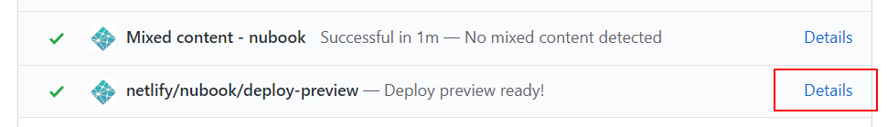

# NUbook

[](https://app.netlify.com/sites/nubook/deploys)

NUbook is the handbook and high-level documentation for the NUbots team. You can read the latest version at <https://nubook.netlify.com/.>

Read on if you want to add or update content.

## Getting started

### Install prerequisites

You'll need [Git](https://git-scm.com/), [Node.js](https://nodejs.org/en/) and [Yarn](https://classic.yarnpkg.com/en/) installed.

<details>
<summary>Ubuntu installation instructions</summary>

1. Install Git by running the following commands:

```
sudo apt update
sudo apt install git
```

2. Install the latest version of Node.js by following the instructions [here](https://github.com/nodesource/distributions/blob/master/README.md#installation-instructions) to (pick the latest version).
3. Install the latest version of Yarn by following the instructions [here](https://classic.yarnpkg.com/en/docs/install#debian-stable).

</details>

<details>
<summary>Windows installation instructions</summary>

1. Download and install Git from <https://git-scm.com/download/win>
2. Download and install Node.js from <https://nodejs.org/en/> (pick the LTS version)
3. Download and install Yarn from <https://classic.yarnpkg.com/latest.msi>

</details>

<details>
<summary>macOS installation installation</summary>

1. Install Homebrew by following the instructions at https://brew.sh/

2. Install Git, Node.js and Yarn

```sh
brew upgrade
brew install git node && brew install yarn
```

</details>

### Install NUbook

1. Navigate to the directory where you want to install NUbook

```sh
cd <path>
```

3. Clone this repo and `cd` into the cloned directory

```sh
git clone https://github.com/NUbots/NUbook.git
cd NUbook
```

4. Install dependencies

```sh
yarn
```

5. Run the [Gatsby](https://www.gatsbyjs.org/) development server

```sh
yarn dev
```

6. Preview the site by visiting [localhost:8000](http://localhost:8000) in a browser

## Contributing content

All additions and edits are done through GitHub pull requests. To add or edit content:

1. Clone the repo, install dependencies, and run the development server as shown in [Getting started](#getting-started) above.
2. Create a new branch for your changes, in the format `your_last_name/short_description_of_change`:

```sh
git checkout -b paye/add_2019_debrief
```

3. Make your changes by adding or editing MDX files in [`src/book/`](src/book/). See below for how to write and organise pages.
4. Preview your changes by visiting [localhost:8000](http://localhost:8000) in a browser.
5. Commit and push your changes to GitHub.
6. Go to the repo on GitHub and create a pull request for your branch. Your pull request will be reviewed, merged, and deployed to the live site.

## Writing Markdown

NUbook content is written using [MDX](https://mdxjs.com/), an extension of [Markdown](https://daringfireball.net/projects/markdown/) with support for dynamic content via [JSX](https://reactjs.org/docs/introducing-jsx.html) and [React](https://reactjs.org/) components. Markdown provides a minimal syntax for writing and styling text content.

GitHub has [a good guide](https://guides.github.com/features/mastering-markdown/) for getting started with Markdown. There's also [this short video series](https://www.youtube.com/playlist?list=PLu8EoSxDXHP7v7K5nZSMo9XWidbJ_Bns3) if you prefer watching.

### Adding images

- Add image files in an `images` folder in the same directory as the file being edited
- Reference images in Markdown:

```md

```

### Adding syntax-highlighted code blocks

Use triple backticks ` ``` ` on separate lines to open and close code blocks. Specify the language with a file extension after the opening backticks for syntax highlighting.

Example C++ code block:

````md
```cpp
#include <iostream>

int main() {
    std::cout << "Hello, World!";
    return 0;
}
```
````

### Adding math symbols and equations

- For inline math, wrap TeX-formatted content with a `$`:

```md
The equation is $c^2 = a^2 + b^2$.
```

- For math blocks, wrap with `$$` on separate lines:

```md
$$
e^{i\phi} = \cos(\phi) + i\sin(\phi)
$$
```

NUbook uses [KaTeX](https://katex.org/) to render math. See https://katex.org/docs/support_table.html for supported symbols and functions.

### Showing content in grids

You can show content such as images, code, and math equations side-by-side in a grid.

The following example shows four images in a 2x2 grid with a caption:

```mdx
<Grid columns='1fr 1fr' rows="1fr 1fr" caption="Some lovely pets">


</Grid>
```

The [columns](https://developer.mozilla.org/en-US/docs/Web/CSS/grid-template-columns) and [rows](https://developer.mozilla.org/en-US/docs/Web/CSS/grid-template-columns) are specified using CSS grid syntax. `fr` is a fractional unit that specifies a fraction of the total available space (width for columns, and height for rows). `columns='1fr 1fr'` creates two columns of equal width, while `rows='1fr 1fr'` creates two rows of equal height.

See the [original pull request](https://github.com/NUbots/NUbook/pull/20) for more examples.

### Showing images in tabs

You can show multiple images in the same place by putting them in tabs. The caption of each image is used for its tab button label.

The following example shows four images in tabs:

```mdx
<TabbedImages>


</TabbedImages>
```

See what the tabs look like in the [kitchen sink](https://nubook.netlify.com/kitchen-sink#tabbed-images).

### Showing alerts and warnings

You can show an informational alert using:

```mdx
<Alert>

Did you know you can lorem ipsum dolor sit amet, consectetur adipisicing elit.
Autem quo deserunt amet suscipit, fuga ullam cumque accusamus doloremque rem
qui?

</Alert>
```

You can also show a warning using:

```mdx
<Alert type='warning'>

Be careful not to lorem ipsum dolor sit amet, consectetur adipisicing elit.
Autem quo deserunt amet suscipit, fuga ullam cumque accusamus doloremque rem
qui.

</Alert>
```

See what the alerts look like in the [kitchen sink](https://nubook.netlify.com/kitchen-sink#alerts).

## Organising pages

Pages are written in MDX files and stored in section and chapter folders in the [`src/book/`](src/book/) directory, and organised as follows:

- Each page's filename is numbered to create the order that will be used for menus and the previous/next page navigation links.
- Each page has "frontmatter" at the top of the file specifying details such as title and description:

```md
---
section: The NUbots Team
chapter: Introduction
title: Introduction to NUbots
description: Learn about what we do, key people, and where to find the lab.
slug: /
---
```

- The frontmatter is written in [YAML](https://gettaurus.org/docs/YAMLTutorial/), with the following supported fields:

| Field         | Type    | Presence | Description                                                                 |
| ------------- | ------- | -------- | --------------------------------------------------------------------------- |
| `section`     | String  | Required | The section the page will appear under in the sidebar menu (case sensitive) |
| `chapter`     | String  | Required | The chapter the page will appear under in the sidebar menu (case sensitive) |
| `title`       | String  | Required | The page title                                                              |
| `description` | String  | Required | A short, one-sentence description of the page content                       |
| `slug`        | String  | Required | The page URL relative to the root of the site, starting with `/`            |
| `keywords`    | List    | Optional | Keywords for the page content, used for SEO                                 |
| `hidden`      | Boolean | Optional | When `true`, removes the page from menus and disables search indexing       |

## Formatting code

All code in NUbook (including Markdown) is formatted using [Prettier](https://prettier.io/) for a consistent style.

This style will be checked automatically when you push code to the repo. If there are any issues, the push will be aborted with an error message listing the files that have issues.

If you need to, you can:

- check formatting by running `yarn format:check`.
- automatically fix formatting issues by running `yarn format`.

## Deploying

Pull requests are automatically deployed as previews using [Netlify](https://netlify.com/), which will run code quality checks and report failures before a deploy.

When a pull request is merged into master, it is automatically deployed to the main site.

## Deploy previews

As mentioned above, pull requests are automatically deployed as previews using Netlify.

The preview URL is of the form `https://deploy-preview-[PR number]--nubook.netlify.com/` where `[PR number]` is the pull request number. For example, `https://deploy-preview-21--nubook.netlify.com/` is the preview URL for pull request number 21.

You can get this URL from the **Details** link of the `netlify/nubook/deploy-preview` check at the bottom of the PR page:



**We recommend that you add this URL to your pull request description after the first deploy.** This makes it easier for reviewers to see your changes rendered without having to clone and build the PR locally.
