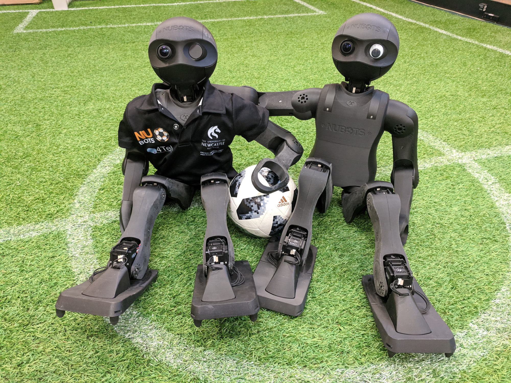

NUbots is a team in the University of Newcastle’s robotics research group focused on developing humanoid soccer-playing robots for the international RoboCup competition. The team is a multidisciplinary group of students and academics, developing both hardware and software for the robots.

The team conducts and publishes original research in numerous areas related to robotics - including computer vision, robotic locomotion and control, and more. See [Areas of Research](/team/areas-of-research) and [Publications](/team/publications) for further details.

## Key People

The team is led and supported by academics and student team leaders.

- **Associate Professor Stephan Chalup** (Computer Science and Engineering) - Head of the Newcastle Robotics Lab and NUbots
- **Dr. Alexandre Mendes** (Computer Science and Software Engineering) - Deputy Head of NUbots
- **Ysobel Sims** (Mathematics and Computer Science) - Student Team Leader
- **Josephus Paye II** (Computer Science) - Mentor, Ex-Team Leader
- **Alex Biddulph** (Computer Engineering) - Mentor, Ex-Team Leader
- **Dr. Trent Houliston** (Software Engineering) - Mentor, Ex-Team Leader

See [Current Team](/team/current-members) for our current team members and [Past Members](/team/past-members) for past members.

## The NUbots Lab

The NUbots team works in the Robots and Brain Architecting Lab in ES115A. Feel free to stop by at any time for a tour!
