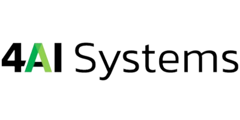
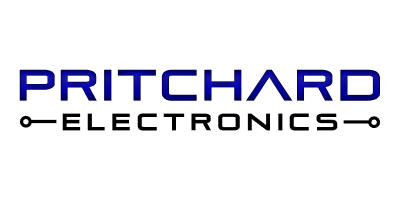
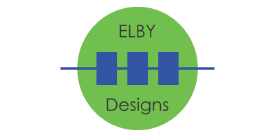

## Platinum Sponsors

## Sponsors

The Office of the NSW Chief Scientist & Engineer is committed to encouraging students to consider a future career in a science-, technology-, engineering- or mathematics-related (STEM-related) field.
The Office offers funding to NSW high school and tertiary students participating in STEM-related courses, competitions and events through several programs including the Science & Engineering Challenge, the Supporting Young Scientists Equity and Access Program and the STEM Student Competition Sponsorship Program. 

