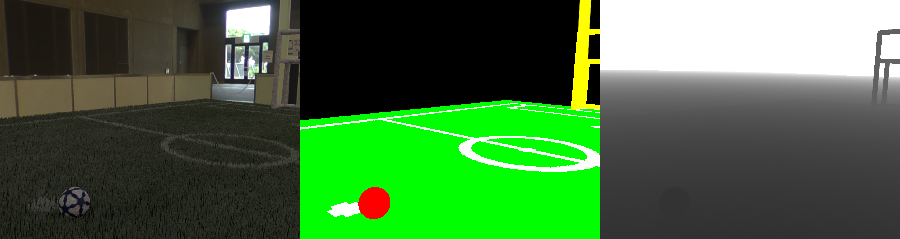
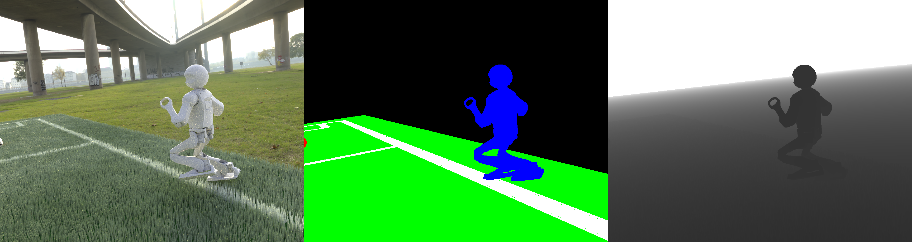

---

## Motivation
As the power of state-of-the-art deep learning methods increases, so does the requirement for large, fully annotated datasets. Particularly in terms of object recognition and classification computer vision tasks, annotation of this data requires considerable time and effort when performed manually by humans. 

The NUpbr project aims to reduce this annotation time by allowing for synthetic generation and automatic annotation of image data via the [Blender](https://www.blender.org/) 3D rendering engine. To ensure the data is comparable to that of realistically obtained data, [physically-Based Rendering (PBR)](https://en.wikipedia.org/wiki/Physically_based_rendering) materials are used. Additionally, [Image-Based Lighting (IBL)](http://ict.usc.edu/pubs/Image-Based%20Lighting.pdf) is used with High-Dynamic Range (HDR) environment maps to provide semi-synthetic image support. 

The tool is capable of outputting raw RGB images taken from random points of view within the scene, as well as generating the corresponding segmentation image, depth map, and various metadata for the current scene.

---

## How it Works
NUpbr constructs a soccer field scene with user-specified dimensions. By default, this includes two goals, a soccer ball and multiple NUgus robots. 

#### Environment
The environment map defines how the IBL will light the scene, as well as the background for the RGB image. NUpbr expects three files per environment map: the raw HDR map, HDR mask image, as well as a metadata file for the HDR. `TODO`

#### Balls
The ball is either constructed using a preconstructed model (`.fbx`) with corresponding colour and/or normal maps, or just via a UV colour map for the ball. To collect the colour and normal maps for the ball, a similar recursive folder search to environment maps is taken place to find an image file matching the regular expression `colou?rs?` (with a desired image extension) for the colour map, and `norm(?:al)?s?` for the normal maps. The configurable properties for the ball can be found in `scene_config.py` within `resources["ball"]`.

#### Field
When the user specifies that the field is to be synthetically generated, a hair particle system is used to create grass on the field. A UV map of the field lines is generated based on the specified field dimensions, which is then mixed with the grass colour to create field lines within the synthetic grass. A PBR material is used for the grass, using the grass and field line colouring for the base colour of the field. The segmentation colouring for the field is given a base colour (e.g. green), with the field lines given a separate colour (e.g. white). The configurable properties for the field can be found in `scene_config.py` within `resources["field"]`.

#### Goals
The goals are constructed based on the desired goal dimensions. These goals can either be generated as rectangular or rounded. Using a PBR material, the goals are given a white colour. The segmentation colouring for the goals are only applied to the front quad (goal posts and crossbar). The configurable properties for the goals can be found in `scene_config.py` within `resources["goal"]`.

#### Robots
`TODO`

---

## Examples

---

## Usage 
The NUpbr repository can be found [within the NUbots organisation](https://github.com/NUbots/NUpbr). To run the data generation script, ensure [Blender 2.79](https://www.blender.org/download/previous-versions/) is installed. `TODO`

---

## Status
#### Ongoing Work
- Rigging of robot models to generate realistic poses
- Replacement of hair particle system with grass cards to reduce performance overhead

#### Future Work
- Porting to Blender 2.8
- Including optical flow output
- Generating a video stream of consecutive images taken along a trajectory
