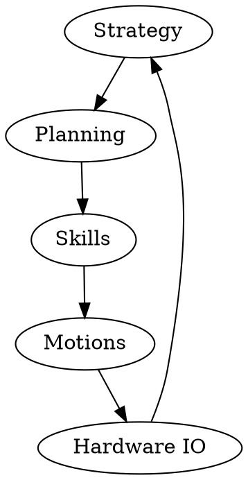

The NUbots repository is the main codebase that runs on the robots. Its purpose is to control the robot during RoboCup matches. The NUbots codebase, along with all other NUbots code, is open source and can be [found on GitHub](https://github.com/NUbots/NUbots/). The primary language in the NUbots codebase is C++.

The main parts of the NUbots codebase are behaviour, motion, vision, and localisation. Behaviours include strategy, planning and skills. Motion includes kicking, getting up, and walking. Vision includes ball, goal and field detectors. Localisation determines where the robot, ball and the field are in the world through odometry.

At the top level, the robot will use strategy to decide what to do based on the game state. This includes unique behaviour for penalty shoot-outs.

The next level down is planning. This includes planning the path to walk along to get to the ball facing the right goal.
Below planning is skills. Skills include kicking, walking, getting up, and looking at objects.

Next is motions. Motions include how the robot moves its feet to walk, and what movements it does to kick or get up.

After motions is hardware input and output. The hardware will output the commands and input the information from the world. This will then go through a sensor filter so that the robot can interpret the information. This information then influences strategy.

All these modules are connected using NUClear, a message passing software architecture. More can be found on NUClear [here](https://nuclear.readthedocs.io/en/latest/).



## Roles

The robot codebase contains roles, which are recipes for creating a binary to run on a robot. A role file lists all the modules to be used in that binary. Only modules included in the role file will run, provided the code is [triggered](/system/foundations/nuclear#nuclear-dsl). All roles can be found in the [roles folder](https://github.com/NUbots/NUbots/tree/main/roles) in the first level of the repository and have the extension `.role`. For specifics about the NUClear roles system, see the [NUClear page](/system/foundations/nuclear#nuclear-roles).

When adding modules to the list in a role, use the syntax `path::to::module`. For example, if you want to include the [`DataLogging` module](https://github.com/NUbots/NUbots/tree/main/module/support/logging/DataLogging), check the path to that module relative to the `module` folder. The path is `support/logging/DataLogging`, so we include the line `support::logging::DataLogging`.

The following is a table of roles that exist in the NUbots codebase and possible use cases for them.

| Role Name             | Usage                                                                                                                                                                                                  |
| --------------------- | ------------------------------------------------------------------------------------------------------------------------------------------------------------------------------------------------------ |
| `fake/keyboardwalk`   | Test parts of the code without a real robot. Demonstrate basic functionality of the robot. Part of the [Getting Started](/guides/main/getting-started) example since it does not require a real robot. |
| `fake/visualmesh`     | Test the vision system, such as detection of balls and goals, in a simulated environment.                                                                                                              |
| `firmwareinstaller`   | Install subcontroller firmware to the robot.                                                                                                                                                           |
| `keyboardwalk`        | Demonstrate the robot manually with a keyboard, particularly in a setting without a field.                                                                                                             |
| `natnet`              | Get motion capture data from a [Motive](https://optitrack.com/software/motive/) motion capture system.                                                                                                 |
| `playback`            | Play back data to view in NUsight without triggering any other processes in the system.                                                                                                                |
| `ps3walk`             | Demonstrate the robot manually with a PS3 controller, particularly in a setting without a field.                                                                                                       |
| `robocup`             | Play RoboCup games on the real robot.                                                                                                                                                                  |
| `scriptrunner`        | Run scripts such as the `Stand.yaml` script, which is useful to run before doing anything with the robot.                                                                                              |
| `scripttuner`         | Tune/modify/create [scripts](/system/subsystems/motion#script-engine).                                                                                                                                 |
| `systemconfiguration` | Ensures the robot is set up with required packages, networking and more.                                                                                                                               |
| `test/behaviour`      | Test individual behaviours in isolation.                                                                                                                                                               |
| `test/camera`         | Test if the cameras are working and [calibrate the cameras](/guides/main/camera-calibration).                                                                                                          |
| `test/director`       | Tests the Director system.                                                                                                                                                                             |
| `test/gamecontroller` | Test the connection between the robot and [GameController](https://github.com/RoboCup-Humanoid-TC/GameController).                                                                                     |
| `test/localisation`   | Test localisation using an interface similar to keyboard walk.                                                                                                                                         |
| `test/nusight`        | Test the connection with NUsight. This role only sends dummy chart data through the NUsightHarness module.                                                                                             |
| `test/plotjuggler`    | Test the connection with PlotJuggler.                                                                                                                                                                  |
| `test/sensor`         | Test odometry (needs NUsight). Test the subcontroller and servo data without the robot moving.                                                                                                         |
| `test/visualmesh`     | Test the vision system on a real robot.                                                                                                                                                                |
| `webots/behaviour`    | Test behaviours in isolation within Webots.                                                                                                                                                            |
| `webots/keyboardwalk` | Test motions in Webots with manual control.                                                                                                                                                            |
| `test/localisation`   | Test localisation using an interface similar to keyboard walk within Webots.                                                                                                                           |
| `webots/robocup`      | Play RoboCup games in the Webots simulator.                                                                                                                                                            |
| `webots/scripttuner`  | Tune/modify/create [scripts](/system/subsystems/motion#script-engine) in the Webots simulator.                                                                                                         |
| `webots/webots`       | Test the connection between the robot code and Webots.                                                                                                                                                 |

In a role, you should have only one platform. Possible platforms are `platform::${SUBCONTROLLER}::HardwareIO`, `platform::HardwareSimulator` and `platform::Webots`.

Any code should run with `platform::HardwareSimulator`, but this is a very basic simulated robot and does not consider gravity - this may be useful if you want to see a motion run on the robot without the robot falling down, or if you want to test if the code runs without setting up the real robot or a simulator.

`platform::${SUBCONTROLLER}::HardwareIO` is used for the real robot. You will get a runtime error if you do not run this on a robot, as it will be unable to find the hardware needed.

`platform::Webots` is used with the Webots simulator. The code will only run if an [appropriate Webots controller is running](/guides/tools/webots-setup).

## System Diagram

This is a general system diagram for the `robocup` role. `Hardware Input` and `Camera` can be replaced with `Webots` when considering the `webots/robocup` role. These roles are used in the main RoboCup competition and the Virtual Season competition. Transitive edges have been removed to make the graph easier to view.


All modules may send information to `Data Logging` to generate NBS files, `Console Log Handler` for command line output, `NUsight` to show data in NUsight, and `PlotJuggler` to show graphs in PlotJuggler.

Other roles may only have a subset of the above diagram, for testing purposes. Some roles, such as `ps3walk` and `keyboardwalk` are also for demonstration purposes and bypass the autonomous planning sections of the system with user input.

## Codedocs

We have documentation automatically generated from the main codebase [here](https://codedocs.nubots.net/).

## Log Level

When printing to the terminal, the `log` function is used.

```cpp
log<NUClear::INFO>("Hello World!");
```

The `NUClear::INFO` is the log level. The log will only print if the module's log level is set to `INFO` or higher in the configuration file. The following table describes the log levels.

| Level   | Description                                                                                                                      |
| ------- | -------------------------------------------------------------------------------------------------------------------------------- |
| `TRACE` | Used to debug code.                                                                                                              |
| `DEBUG` | Used to debug behaviour.                                                                                                         |
| `INFO`  | Used to inform the user of what the module is doing.                                                                             |
| `WARN`  | Used to warn the user that something has gone wrong, but the system can still perform its functions.                             |
| `ERROR` | Used to inform the user that something has gone wrong, and the module cannot perform its intended function at this time.         |
| `FATAL` | Used to inform the user that something has gone wrong, and the module will never be able to perform its intended function again. |
