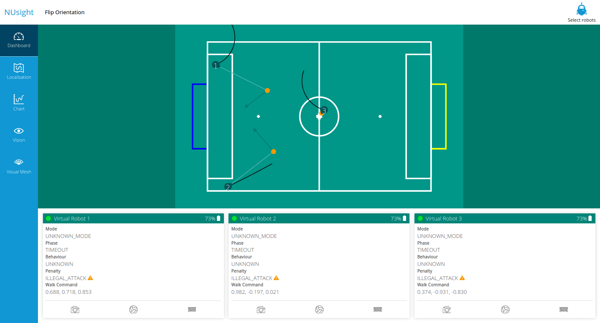
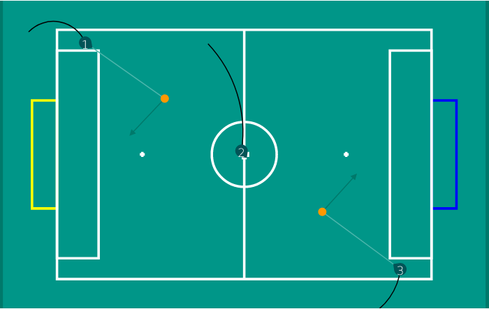
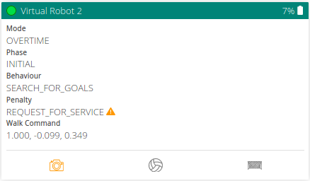
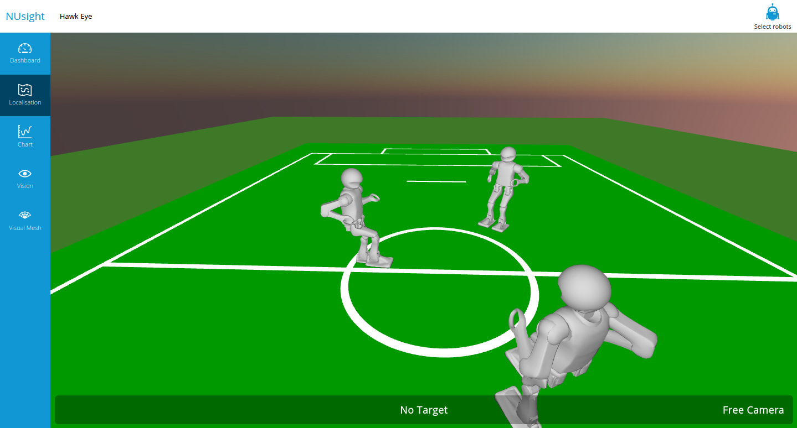
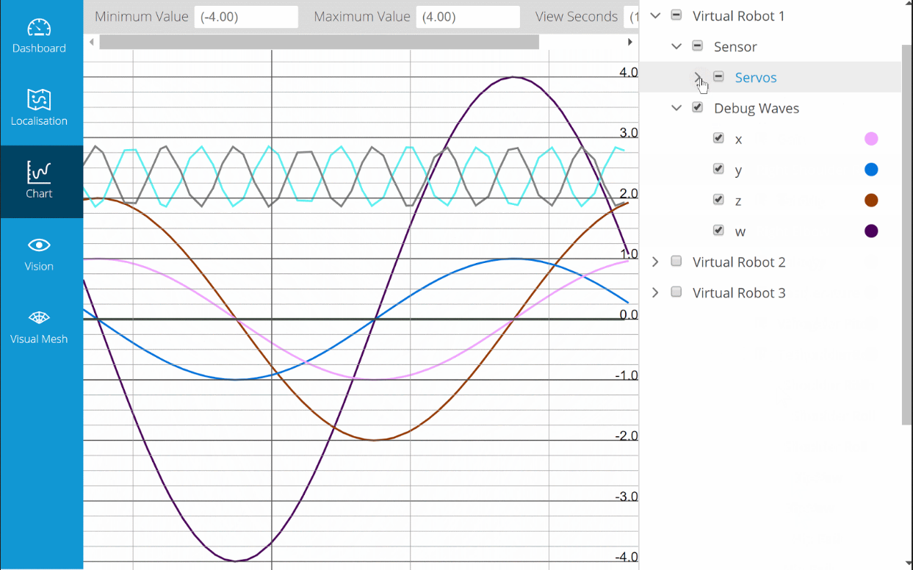
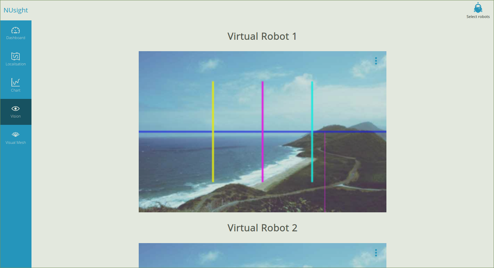

## NUsight Visualization System

### Overview

The NUsight visualization system is a web-based visualizer created in-house for the NUbots team. It provides real time display of information of messages passed inside the NUclear robotics framework. The data that can be visualized in NUsight may come from the real hardware or simulated hardware.

Dasboard displays a bird's eye view of the playing field with the robots loacalized in the field. This section also displays the overall state of all robots.

Localization previews the robot's pose. The visualization data can come from a real robot or a simulated hardware.

Chart visualizes the stream of data being passed to the robots' sensors.

Vision previews the images from the cameras of the robots giving you a robot's eye view.

Visual mesh visualizes the object detection algorithm with the overlay mesh on top of an image.

Select Robots enable the display of real or simulated robots. This affects all the tabs in NUsight

### Dashboard

Flip Orientation flips the playing field to display the mirror image of the previous view of the playing field.

#### Playing Field

The playing field displays all the robots that are currently connected to NUsight. It. The yellow rectangle indicates our own goal. The blue one is the opponent's goal.

Each robot displays the number assigned to it by NUsight. The wedge on the representation of the robot indicates the direction of the robot's orientation. The black arcs coming out of each robot indicates the robot's walk path

The orange dot in the playing field indicates where the robot thinks the ball is located. The green arrow coming out of the orange ball indicates how the robot will kick the ball. Usually it should point towards the opponent's goal.

#### Robot Status Display

This area displays the internal status of a robot, for each robot connected to NUsight. It shows the robot's name, connection status, battery level and the internal state of the robot.

- Mode - Displays the current stage of the game
- Phase - Displays the current phase of the current game mode
- Behavior - Displays what the robot is currently doing
- Penalty - Displays the penalty incurred by the robot, if any
- Walk Command - Displays the forward/backward velocity, left/right velocity and rotation rate of the robot, in that order.
- Camera, Ball and Goal Icons
  - Flash Orange - a new packet is received
  - Red Outline box - Indicates that a long time has passed since the last packet of data was received.
  - Greyed Out - Inactive

### Localization

#### Keymapping

| Keyboard | Action                                                         |
| :------: | -------------------------------------------------------------- |
|    w     | Move forward                                                   |
|    s     | Move backward                                                  |
|    a     | Strafe left                                                    |
|    d     | Strafe right                                                   |
|  Space   | Switch between Free Camera, First Person or Thrid Persion view |

|       Mouse       | Action                                          |
| :---------------: | ----------------------------------------------- |
| Right mouse click | In first or third person, switch between robots |

### Chart

Line Chart/2D Scatter - Switch between a line chart or a scatter plot to represent the data on the chart

Right Panel - Select which robot's data to be plotted on the chart

Minimum Value/Maximum Value - set the chart's plotting boundaries

View Seconds - The rate at which nusight reads from the robot's data stream. Lower value means higher frequency of plotting data

### Vision

This tab can toggle different overlays on the image that is being seen by the robot:

- image
- compass
- Horizon
- Visual Mesh
- Green Horizon
- Balls
- Goals

### Visual Mesh

This section displays the data from the robot's camera and provides a mesh overlay on the image using the Visual Mesh object detection algorithm
