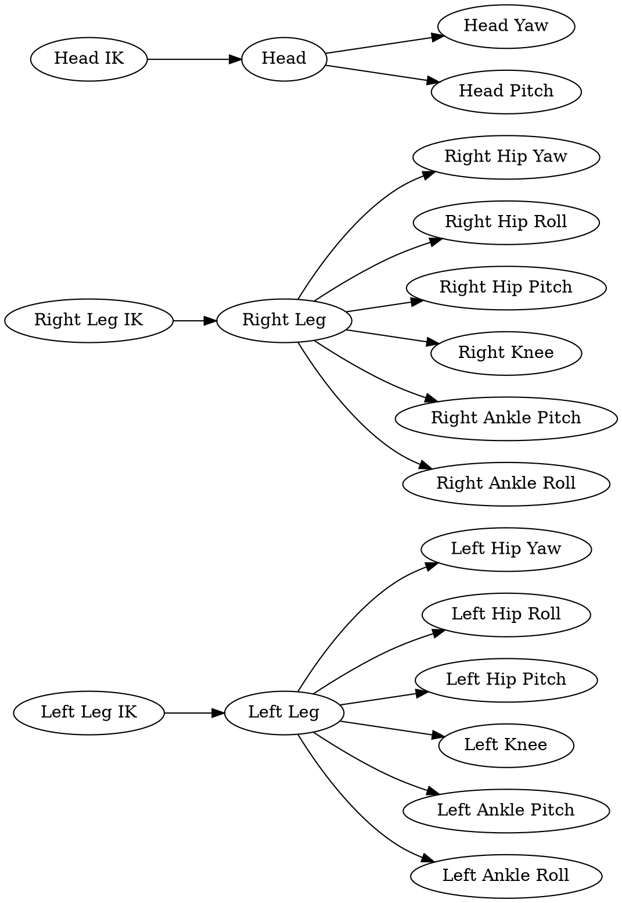
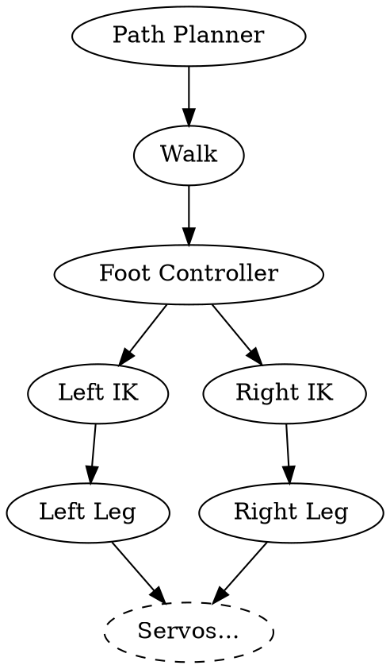

This page details motion modules within the NUbots main codebase, such as the walk engine and the script engine. Information about modules for running and tuning scripts can be found on the [Behaviour](/system/subsystems/behaviour#script-runner) page.

## Actuation

Actuation is the process of moving the robot's joints. The robot has 20 joints, each with a servo motor. The actuation layer is implemented within the Director system. A Provider for each servo and each limb exists so that only one higher level Provider can take control of a particular servo or limb at a time. If the walk has control of the leg, the kick cannot also take control of the leg. If the kick has a higher priority than the walk, the walk will lose control of the leg and the kick will take control.



## Walk Engine

NUbots use an **open loop walk** based on **quintic splines**. This walk engine takes care of the mathematics and control involved in taking steps without falling over. The walk engine does not plan where to walk, only how to walk.

The walk engine will trigger when a [**Walk message**](https://github.com/NUbots/NUbots/blob/main/shared/message/skill/Walk.proto) is [**emitted**](/system/foundations/nuclear#emit-statements) in the [Director system](/system/foundations/director). The walk command gives a vector `[x, y, z]` which represents:

| Variable | Description                                                                                |
| -------- | ------------------------------------------------------------------------------------------ |
| `x`      | velocity in metres per second in the direction of the x axis                               |
| `y`      | velocity in metres per second in the direction of the y axis                               |
| `z`      | yaw in radians per second, positive is counter-clockwise. The 0 point is straight forward. |

The robot's [behaviour](/system/subsystems/behaviour) determines the walk vector.

### Quintic Spline Walk

The Quintic Walk is an **open loop controller** based on [**quintic splines**](/system/foundations/mathematics#splines) (piecewise fifth degree polynomials). It sets points in each direction for rotation and translation and uses those points to create smooth quintic splines.

The engine has support for kicking using quintic splines. Integration of the kick is a work in progress.

The code used for this walk comes from the RoboCup team [**Hamburg Bit-Bots**](https://github.com/bit-bots/bitbots_motion/), which in turn is from [Quentin "Leph" Rouxel and Team Rhoban's walk](https://github.com/Rhoban/model/).

#### Implementation

The walk uses the `Footstep` class to generate the targets for the foot, using the calculated splines.

The `SplineContainer` class holds multiple `Spline` objects. As the `SplineContainer` gets points, they are used to create `Spline`s. These Spline objects are each mapped to names based on what they do. These mappings for the walk and kick are in the table below.

The splines that the `SplineContainer` holds are instances of a generic `Spline` class that holds all the information for a mathematical spline. Each piecewise polynomial in the spline is a `Polynom` object that contains the coefficients for a polynomial.

The specific `Spline` type we use is a `SmoothSpline`, extended from the `Spline` class. Find out more about splines and this specific type of spline on the [**mathematics**](/system/foundations/mathematics#splines) page.

The `TrajectoryUtils` file uses the `SplineContainer` for walking and kicking. It creates a `SplineContainer` with the following splines:

| Name                   | Description                                                                              |
| ---------------------- | ---------------------------------------------------------------------------------------- |
| `IS_DOUBLE_SUPPORT`    | Splines for when the robot is in double support phase, i.e. both feet are on the ground. |
| `IS_LEFT_SUPPORT_FOOT` | Splines for the support foot.                                                            |
| `TRUNK_POS_X`          | The Cartesian position of the robot's torso in the x-axis.                               |
| `TRUNK_POS_Y`          | The Cartesian position of the robot's torso in the y-axis.                               |
| `TRUNK_POS_Z`          | The Cartesian position of the robot's torso in the z-axis.                               |
| `TRUNK_AXIS_X`         | The orientation of the robot's torso in the x-axis.                                      |
| `TRUNK_AXIS_Y`         | The orientation of the robot's torso in the y-axis.                                      |
| `TRUNK_AXIS_Z`         | The orientation of the robot's torso in the z-axis.                                      |
| `FOOT_POS_X`           | The Cartesian position of the robot's flying foot in the x-axis.                         |
| `FOOT_POS_Y`           | The Cartesian position of the robot's flying foot in the y-axis.                         |
| `FOOT_POS_Z`           | The Cartesian position of the robot's flying foot in the z-axis.                         |
| `FOOT_AXIS_X`          | The orientation of the robot's flying foot in the x-axis.                                |
| `FOOT_AXIS_Y`          | The orientation of the robot's flying foot in the y-axis.                                |
| `FOOT_AXIS_Z`          | The orientation of the robot's flying foot in the z-axis.                                |

The points that make up all these splines are in the [WalkEngine.cpp file](https://github.com/NUbots/NUbots/blob/889d5ec2e91b2dc0ab7be59429e3c21b786b7b65/module/motion/QuinticWalk/src/WalkEngine.cpp#L271). The [configuration parameters](https://github.com/NUbots/NUbots/blob/main/module/motion/QuinticWalk/data/config/QuinticWalk.yaml) affect some of these points. Values are all in [SI units](https://en.wikipedia.org/wiki/International_System_of_Units).

### Improved Quintic Spline Walk

We currently use a modified version of the original quintic walk. The new version is highly simplified and uses different logic for the timing and placement of the torso and feet. It uses the `FootController` module to align the feet with the ground.



## Scripts

Scripts are static motions for the robot. They specify what joint angles to move to and how long the robot should take to get to those joint angles. For example, standing up is a script telling the robot to move its joints to the stand position over one second. There can be many of these position specifications in sequence to make the robot do more complex movements like getting up or kicking.

To learn how to tune scripts, see the [ScriptTuner guide](/guides/main/tuning-and-running-scripts#script-tuner).

### Execution

To execute a script, we emit a Director Task message with the appropriate servo Sequence containing the script information. This script information comes from the `load_script` function in the `script` utility.

The `load_script` function takes a YAML file name (eg `Stand.yaml`), finds and reads the file and creates a servo Sequence representing the script. The Sequence is returned and emitted as a Director Task. The Director Task is then executed by the Director system.

```

emit<Task>(load_script<BodySequence>("Stand.yaml"));

```

Scripts can be given a start time. If a script has a start time, it will not start execution until that time. The following would execute the `Stand` script in five seconds.

```

emit<Task>(load_script<BodySequence>("Stand.yaml", NUClear::clock::now() + std::chrono::seconds(5)));

```

### Script files

The script files are YAML files specifying a duration and list of servo targets, in a format like the following:

```yaml
- duration: 1000
  targets:
    - id: HEAD_YAW
      position: 0
      gain: 10
      torque: 100
    - id: HEAD_PITCH
      position: 0.5
      gain: 10
      torque: 100
    - id: R_HIP_YAW
      position: -0.03
      gain: 5
      torque: 100
```

The fields are described in the table below.

| Field      | Description                                                                                                                                                    |
| ---------- | -------------------------------------------------------------------------------------------------------------------------------------------------------------- |
| `duration` | An integer in milliseconds.                                                                                                                                    |
| `position` | A float representing the angle of the servo in radians.                                                                                                        |
| `gain`     | A float representing how much effort the servo will use to get to the target position. Gain is often between 5 and 15.                                         |
| `torque`   | A float, where 0 represents no torque and 100 represents torque being on. Torque is 100 unless you want that servo relaxed, in which case it will be 0.        |
| `id`       | One of the servo IDs listed in [ServoID.h](https://github.com/NUbots/NUbots/blob/467f458c687419056e2487fe468c7f22d19a6965/shared/utility/input/ServoID.h#L30). |

Script files can be found in the ScriptEngine module. Scripts can be specific to a robot. More on scripts can be found on the [Configuration and Script System](/system/foundations/config-script) page.
