The NUsight visualisation tool is a web-based visualiser created in-house for the NUbots team to help with building and debugging robot systems. It provides a real-time view of information from other systems using [NUClear networking](/system/foundations/nuclear). The data shown in NUsight can come from either real hardware or simulated hardware. The NUsight interface contains multiple tools in various tabs with different debugging capabilities.

This page focuses on explaining the NUsight system itself and the tools it provides. For instructions on how to build and run NUsight, see the [Getting Started guide](/guides/main/getting-started#get-build-and-run-nusight). For development and contribution guidance, refer to [Contributing to NUsight](/guides/tools/nusight-contribution).

| Tab          | Description                                                                                 |
| ------------ | ------------------------------------------------------------------------------------------- |
| Localisation | Displays localisation-related state and environment elements, with configurable visibility. |
| Odometry     | Shows the robot’s orientation using a 3D axis representation.                               |
| Chart        | Visualises the stream of data being passed to the robots' sensors.                          |
| Vision       | Previews the images from the cameras of the robots giving you a robot's eye view.           |
| Logs         | Logs system messages with filtering by severity level for debugging and monitoring.         |
| Servos       | Displays a 3D robot model with live servo positions and information.                        |
| Director     | Provides a view of high-level behaviour and state managed by the Director system.           |

The **Select robots** button in the top-right corner allows you to choose which real or simulated robots to display. This affects all tabs in NUsight.

The **Scrub NBS** button allows recorded NBS playback files to be loaded and replayed, enabling inspection of previously captured robot data for debugging and analysis.

## Localisation

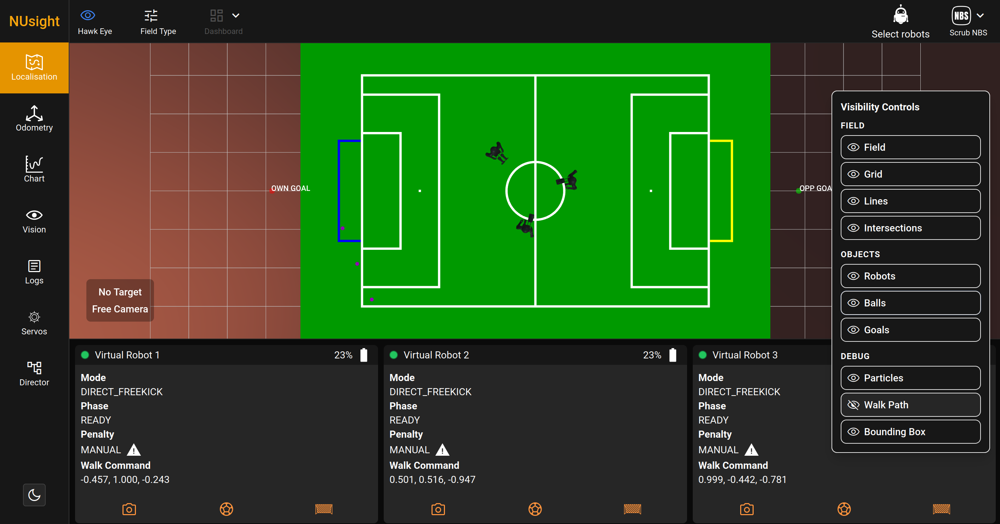

The Localisation tab displays a 3D scene of connected robots positioned on the field. The **Hawk Eye** button resets the viewpoint to a top-down view of the field, and the **Field Type** button switches between Lab and RoboCup field dimensions.

The viewport is interactive and can be navigated using the following controls (after clicking the viewport to focus):

| Keyboard/Mouse | Action                                                        |
| :------------: | ------------------------------------------------------------- |
|  <kbd>w</kbd>  | Move forward                                                  |
|  <kbd>s</kbd>  | Move backward                                                 |
|  <kbd>a</kbd>  | Strafe left                                                   |
|  <kbd>d</kbd>  | Strafe right                                                  |
|     Space      | Switch between Free Camera, First Person or Third Person view |

### Dashboard

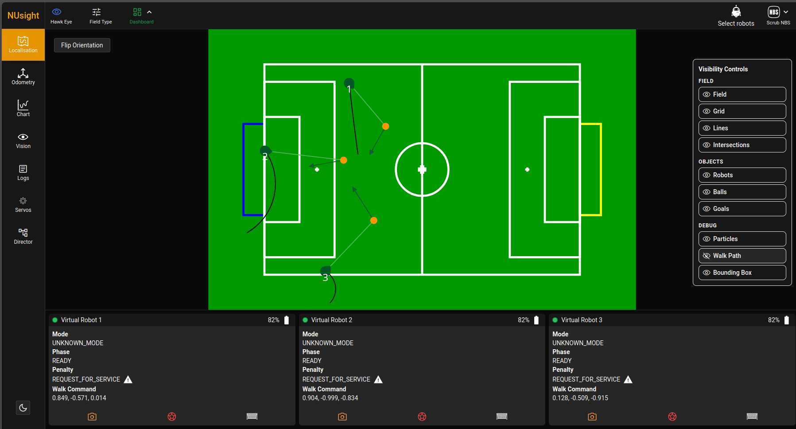

The Dashboard provides an overview of the robots' state and behaviour on the field. The **Flip Orientation** button in the top-left corner mirrors the field view, allowing the scene to be displayed from the opposite perspective. The yellow rectangle represents our goal, while the blue rectangle represents the opponent’s goal.

| Feature          | Image                                                                                       | Description                                                                                                                         |
| ---------------- | ------------------------------------------------------------------------------------------- | ----------------------------------------------------------------------------------------------------------------------------------- |
| Dark green wedge | 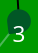     | Represents a robot’s position on the field. The number indicates the robot identifier, and the wedge shows the robot’s orientation. |
| Black arcs       | 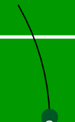 | Indicates the robot’s planned or recent walk path.                                                                                  |
| Orange circle    | 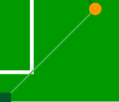        | Indicates the perceived position of the ball relative to the robot.                                                                 |
| Green arrow      | 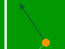            | Indicates the intended kick direction for the ball.                                                                                 |

### Robot Status Display

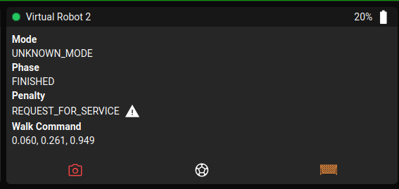

This area displays internal status information for each robot connected to NUsight. It includes the robot's name, connection status, battery level, and current internal state.

- **Mode** – Displays the current stage of the game.
- **Phase** – Displays the current phase within the selected game mode.
- **Behaviour** – Displays what the robot is currently doing.
- **Penalty** – Displays any penalty currently applied to the robot.
- **Walk Command** – Displays the commanded forward/backward velocity, left/right velocity, and rotation rate of the robot, in that order.
- **Camera, Ball, and Goal icons**
  - **Flashing orange** – A new data packet has been received.
  - **Red outline** – Indicates that a significant amount of time has passed since the last data packet was received.
  - **Greyed out** – Indicates that the data source is inactive.

## Odometry

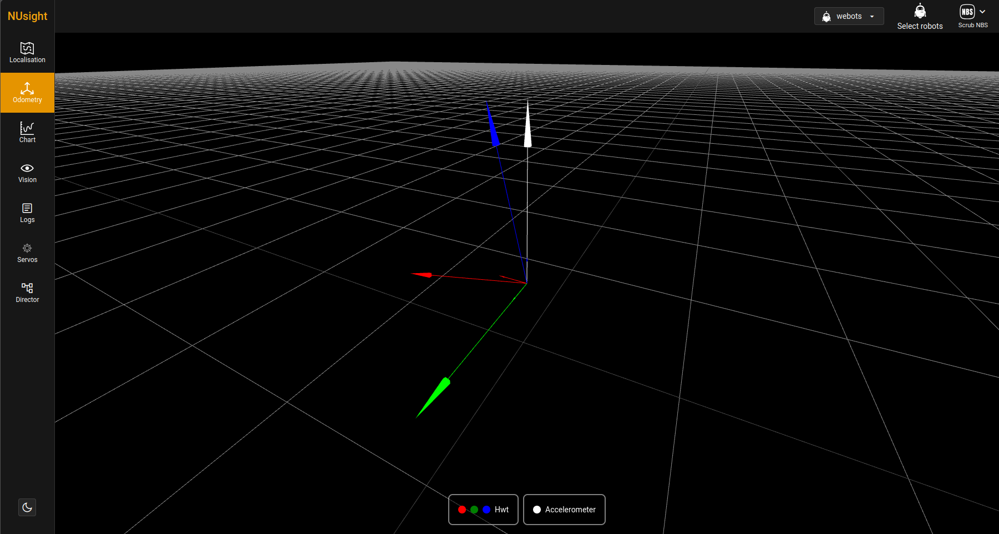

The Odometry tab visualises the robot’s estimated pose and orientation in 3D space. The coordinate axes provide insight into how the robot perceives its movement and rotation over time, which is useful for debugging motion and localisation-related behaviour.

## Chart

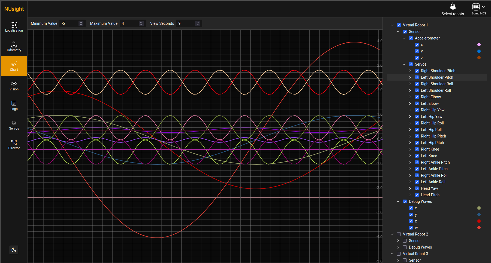

The Chart tab displays time-series data on a coordinate plane, allowing multiple data streams to be visualised simultaneously.

| Feature                 | Description                                                                                                                     |
| ----------------------- | ------------------------------------------------------------------------------------------------------------------------------- |
| Line Chart / 2D Scatter | Switch between line and scatter plot representations of the data. The scatter plot option is currently unsupported.             |
| Right Panel             | Select specific data sources from individual robots to display on the chart. Also allows adjusting the colour of plotted lines. |
| Minimum / Maximum Value | Defines the vertical plotting range of the chart.                                                                               |
| View Seconds            | Controls the time window displayed on the chart (x-axis range).                                                                 |

## Vision

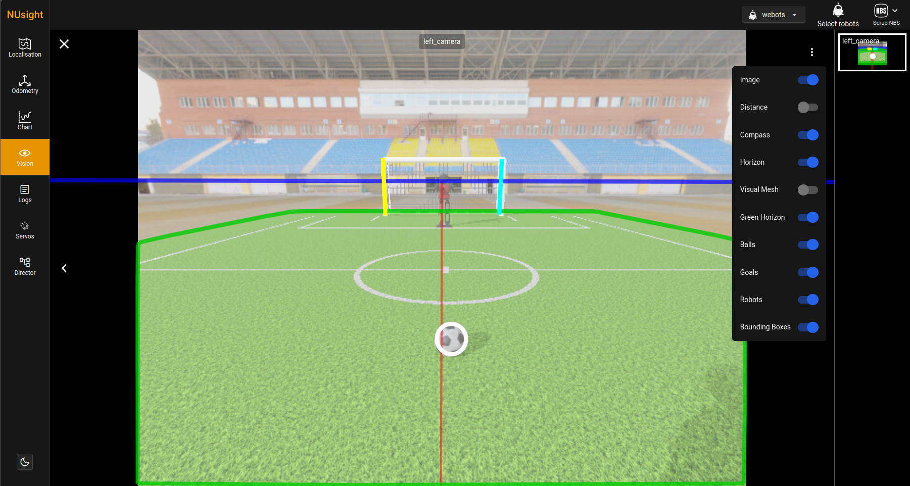

The Vision tab displays images received from the robot cameras, along with optional visual overlays produced by the vision system. These overlays assist with understanding how the robot perceives its environment and what features it detects.

Each image includes controls that allow different visual elements to be enabled or disabled, such as detected objects, horizon lines, and field features.

## Logs

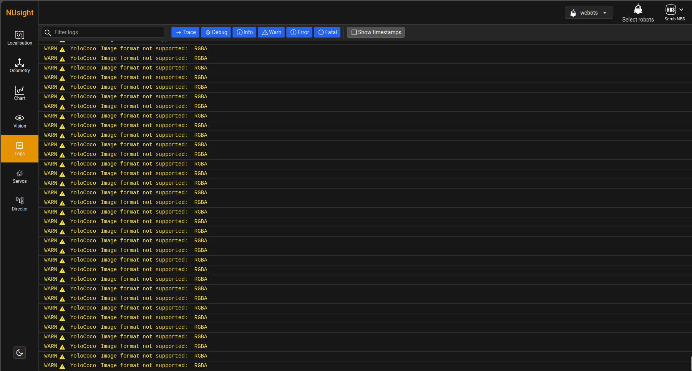

The Logs tab displays generated system messages. These messages help monitor runtime behaviour and assist with debugging issues.

Log messages can be filtered by severity level to focus on specific types of information.

| Level | Description                                                  |
| ----- | ------------------------------------------------------------ |
| Trace | Detailed diagnostic information for lower-level debugging.   |
| Debug | Information useful for development and troubleshooting.      |
| Info  | General information about normal system operation.           |
| Warn  | Indicates unexpected behaviour that may require attention.   |
| Error | Indicates a problem that affects functionality.              |
| Fatal | Indicates a critical failure that prevents normal operation. |

The search bar allows filtering logs by text, and the **Show timestamps** option displays the time each message was generated.

## Servos

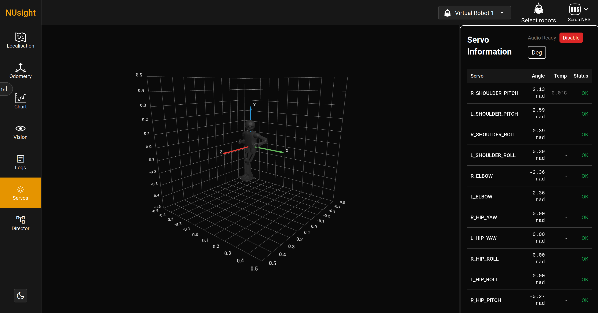

The Servos tab displays a 3D robot model with live joint positions and related servo information. This helps monitor robot posture, movement, and hardware status during operation.

Information such as joint angles, temperatures, and status values can be used to help debug motion and behaviour.

## Director

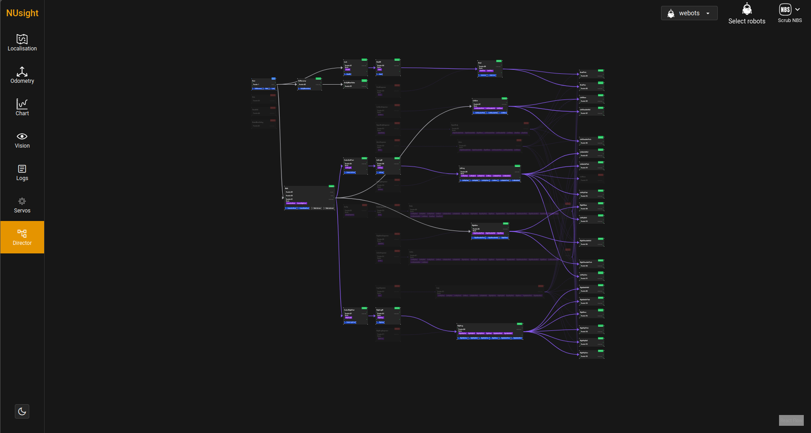

The Director tab visualises the robot’s high-level behaviour structure as a graph. It shows how different behaviour components relate to each other and how the system transitions between states.

This view helps provide insight into the organisation of behaviours and the robot’s decision-making flow during operation.
