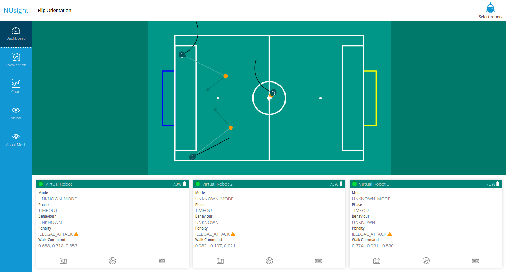
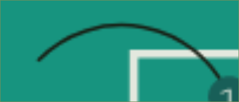
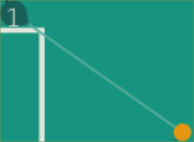
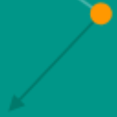
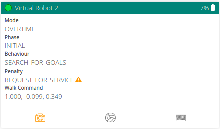

The NUsight visualisation tool is a web-based visualiser created in-house for the NUbots team, to aid in building and debugging our systems. It provides real-time display of information from other systems using [NUClear networking](/system/foundations/nuclear). The data visualised in NUsight may come from real hardware or simulated hardware. The NUsight interface contains multiple tools in various "tabs" with different debugging capabilities. You can get NUsight by following the steps outlined in the [Getting Started page](/guides/main/getting-started#nusight).

| Tab          | Description                                                                                                                                         |
| ------------ | --------------------------------------------------------------------------------------------------------------------------------------------------- |
| Dashboard    | Displays a bird's eye view of the playing field with the robots localised in the field. This section also displays the overall state of all robots. |
| Localisation | Previews the robot's pose. The visualisation data can come from a real robot or simulated hardware.                                                 |
| Chart        | Visualises the stream of data being passed to the robots' sensors.                                                                                  |
| Vision       | Previews the images from the cameras of the robots giving you a robot's eye view. Contains overlays for the Visual Mesh and vision objects.         |

The 'Select Robots' button in the top right corner enables the display of specific real or simulated robots. This affects all the tabs in NUsight.

## Dashboard

The Dashboard gives an overview of the state of the robots on the field.

The 'Flip Orientation' button in the top left hand corner flips the playing field to display the mirror image of the previous view of the playing field.

#### Playing Field

The playing field displays all the robots that are currently connected to NUsight. The yellow rectangle indicates our own goal. The blue rectangle is the opponent's goal.

| Feature          | Image                                                                                                               | Description                                                                                                                                       |
| ---------------- | ------------------------------------------------------------------------------------------------------------------- | ------------------------------------------------------------------------------------------------------------------------------------------------- |
| Dark Green Wedge |       | The robot's position on the field. Displays the robot's number assigned by NUsight. The wedge indicates the direction of the robot's orientation. |
| Black Arcs       |                        | Indicates the robot's walk path.                                                                                                                  |
| Orange Circle    |  | Indicates where the robot thinks the ball is located.                                                                                             |
| Green Arrow      |           | Indicates how the robot will kick the ball. Usually it should point towards the opponent's goal.                                                  |

#### Robot Status Display

This area displays the internal status of a robot, for each robot connected to NUsight. It shows the robot's name, connection status, battery level and the internal state of the robot.

- Mode - Displays the current stage of the game
- Phase - Displays the current phase of the current game mode
- Behavior - Displays what the robot is currently doing
- Penalty - Displays the penalty incurred by the robot, if any
- Walk Command - Displays the forward/backward velocity, left/right velocity and rotation rate of the robot, in that order.
- Camera, Ball and Goal Icons
  - Flash Orange - a new packet is received
  - Red Outline box - Indicates that a long time has passed since the last packet of data was received.
  - Greyed Out - Inactive

## Localisation

The localisation view shows a 3D model of any connected robots with their position and orientation on the field. It is interactive and can be used with the following commands:

|  Keyboard/Mouse   | Action                                                         |
| :---------------: | -------------------------------------------------------------- |
|   <kbd>w</kbd>    | Move forward                                                   |
|   <kbd>s</kbd>    | Move backward                                                  |
|   <kbd>a</kbd>    | Strafe left                                                    |
|   <kbd>d</kbd>    | Strafe right                                                   |
|       Space       | Switch between Free Camera, First Person or Third Persion view |
| Right mouse click | In first or third person, switch between robots                |

## Chart

The chart view shows a coordinate plane with a variable graphed against time. Multiple graphs can be overlayed on top of each other.

| Feature               | Description                                                                                                                            |
| --------------------- | -------------------------------------------------------------------------------------------------------------------------------------- |
| Line Chart/2D Scatter | Switch between a line chart or a scatter plot to represent the data on the chart. Currently the scatter plot is unsupported.           |
| Right Panel           | Select specific datapoints from specific robots to be plotted on the chart. Also allows for changing the color of a line on the chart. |
| Minimum/Maximum Value | Set the chart's plotting boundaries.                                                                                                   |
| View Seconds          | The amount of seconds shown in the chart at any given time. This can be thought of as how 'zoomed in' the chart is in the x-axis.      |

## Vision

The vision tab shows any images received from the robot/s. It shows the images in the order in which they are received. Each image has a drop down menu with toggles for different features. These features are from the vision system. They are

- Raw image
- Compass
- Horizon
- Visual Mesh
- Green horizon
- Balls
- Goals
