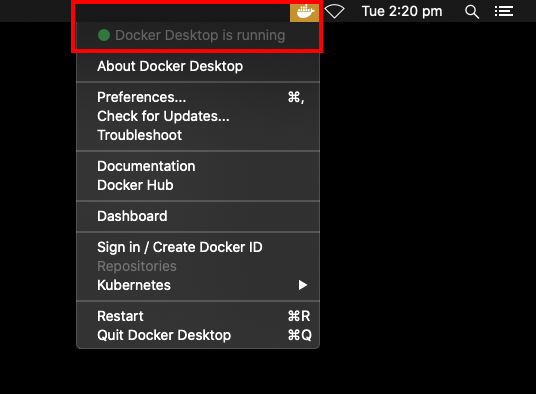

Throughout this guide we will focus on completing a specific example task. This task will involve setting up the codebase, running the keyboardwalkfake binary (which uses simulated hardware) and seeing the robot move in NUsight.

## Prerequisites

### Git

For our example, we will need Git to get the codebase. This will happen later in this guide.

[Git](https://git-scm.com/) is a [version control](https://git-scm.com/book/en/v2/Getting-Started-About-Version-Control) tool. We use it to track changes to the codebase and work together on the same codebase without getting in each other's way.

To work on the NUbots code, you'll need to know the basics of using Git, specifically:

- how to clone remote repositories onto your computer
- how to create branches
- how to add and commit changes
- how to fetch, pull, and push changes

You can do all the above using [Git in the terminal](https://git-scm.com/docs/git), or you can use a Git GUI tool such as [GitKraken](https://www.gitkraken.com/) or [GitHub Desktop](https://desktop.github.com/).
There is a guide to using Git in NUbots [here](/guides/general/git).

<Alert type='info'>

To use Git in the terminal on Windows, get [Git Bash](https://gitforwindows.org/).

</Alert>

### Docker

Docker is a container system that allows you to install development tools and run builds in an isolated environment that won't affect the rest of your system. We use it to set up the NUbots build system and run builds and binaries.

You will need to perform the steps correctly to set up Docker for your operating system to complete the example.

<details>

<summary>Ubuntu</summary>

1. Add Docker's stable repository and update the apt package index.

   ```bash
   curl -fsSL https://download.docker.com/linux/ubuntu/gpg | sudo apt-key add -
   sudo add-apt-repository \
     "deb [arch=amd64] https://download.docker.com/linux/ubuntu \
     focal \
     stable"
   sudo add-apt-repository universe
   sudo apt update
   ```

   If you are on Linux Mint, this will give a malformed input error. Remove `[arch=amd64]` and rerun.

   ```bash
   sudo add-apt-repository \
    "deb https://download.docker.com/linux/ubuntu \
    focal \
    stable"
   ```

2. Install the latest version of Docker.

   ```bash
   sudo apt-get install docker-ce docker-ce-cli containerd.io
   sudo apt-get install python3 python3-pip
   ```

3. Add the current user to the Docker group, so you can run Docker commands without `sudo`.

   ```bash
   sudo usermod -aG docker "${USER}"
   ```

4. Reboot to make the group change take effect.

</details>

<details>

<summary> MacOS </summary>

1. Install Homebrew by following the instructions at [brew.sh](https://brew.sh/).

2. Install Python 3 and Docker using Homebrew.

   ```bash
   brew install python3
   brew cask install docker
   ```

3. Run the Docker Desktop app that was installed and ensure that Docker is running by checking that it shows a green dot in the app menu bar.

   

4. Go to **Advanced settings** in Docker Desktop's **Preferences** and increase the memory available to containers to at least 4GB. By default Docker will allocate 2GB of memory to containers, which is not enough to build the NUbots docker image.

</details>

<details>

<summary>Windows</summary>

1. Ensure your Windows build is at least 2004.

   - Press <kbd>WIN</kbd> + <kbd>R</kbd>.
   - Type `winver` and hit <kbd>Enter</kbd>.
   - Inspect the version to verify it is at least 2004. Upgrade Windows if not.

2. Enable WSL 2

   - Open Windows Powershell in administrator mode.
   - Run the following to install WSL:
     ```
     dism.exe /online /enable-feature /featurename:Microsoft-Windows-Subsystem-Linux /all /norestart
     ```
   - Run the following to enable the Virtual Machine Platform feature needed for WSL:
     ```
     dism.exe /online /enable-feature /featurename:VirtualMachinePlatform /all /norestart
     ```
   - Restart your computer.

3. Go to the Microsoft Store. Search for Ubuntu and install it. Launch Ubuntu.

4. Ensure Ubuntu is using WSL 2.

   - In Powershell, run `wsl --list --verbose`.
   - If the version is not 2, run `wsl --set-version ubuntu 2`.

   <Alert type='info'> Note that 'ubuntu' in the last command may need to be capitalised. Check the exact spelling from the list output in the first command of this step. </Alert>

   <Alert type='info'>

   If you have issues with the Linux kernel needing to be updated, get the update from the [Microsoft page](https://docs.microsoft.com/en-us/windows/wsl/wsl2-kernel).

   </Alert>

5. Download and install [Docker for Windows](https://docs.docker.com/docker-for-windows/install/). Choose the latest stable version. Ensure you enable WSL 2 features.

6. Configure Docker settings.

   - In the system tray, right-click the Docker icon and select **Settings**.
   - In **General**, enable the **Use the WSL 2 based engine** option.
   - In **Resources: WSL Integration** enable Ubuntu.

7. In Ubuntu run `sudo apt update` followed by `sudo apt upgrade`.

8. Ensure you have pip3 by running

   ```bash
   sudo apt install python3-pip
   ```

<Alert type='info'>The commands in the rest of this guide should be run in the WSL Ubuntu terminal except where specified to run them elsewhere, such as on a real robot.</Alert>

<Alert type='info'>

When you clone/download the code, you should do so in the WSL Ubuntu terminal, from your home folder. Outside of WSL, the path to the cloned NUbots code folder will be of the form `\\wsl$\Ubuntu\home\<USERNAME>\NUbots`, where `<USERNAME>` is the username you set up for Ubuntu. This path should be the one you use to open the code in text editors such as Visual Studio Code.

</Alert>

<Alert type='info'>

GitKraken will not allow you to open the repository outside of WSL. Use the steps described in this article to [set up your system to use GitKraken in WSL](https://medium.com/@chuckdries/installing-gitkraken-in-wsl-2-15bf6459f823).

</Alert>

<Alert type='info'>

To be able to copy and paste into the Ubuntu terminal, right-click on the bar at the top of the Ubuntu window. Then click on **Properties**, and enable **Use Ctrl+Shift+C/V as Copy/Paste** in the **Options** tab. Note that this is <kbd>Ctrl</kbd>+<kbd>Shift</kbd>+<kbd>C</kbd>/<kbd>V</kbd> not <kbd>Ctrl</kbd>+<kbd>C</kbd>/<kbd>V</kbd>.

</Alert>

</details>

### A Text Editor

This section is not required for our example, but it is a good step to do in case you need to edit code in the future.

You'll need a text editor to make changes to the code. We recommend [Visual Studio Code](https://code.visualstudio.com/Download), but feel free to use your favourite editor.

To ensure a consistent [code style](https://en.wikipedia.org/wiki/Programming_style), NUbots uses `clang-format`, a tool that reformats all code files in the repository to have the same style, even if they're written by different people. For convenience, you can install the `clang-format` [extension](https://marketplace.visualstudio.com/items?itemName=xaver.clang-format) in Visual Studio Code to automatically format the files when you make changes.

Another useful tool for editing NUbots code in Visual Studio Code is the Remote Development [extension pack](https://code.visualstudio.com/docs/remote/containers). This pack allows Visual Studio Code to work from within the Docker container, using the tools and libraries installed there.

## Getting the Code

With all the prerequisites in place, you can now clone the NUbots repository from GitHub to build it and run the code. This is an important step in our example.

1. Clone the repo by running the following command in a terminal.

   ```bash
   git clone --recursive https://github.com/NUbots/NUbots.git
   ```

   The repo will be cloned into a `NUbots` directory in the current working directory.

2. Change into the cloned directory and install the required Python dependencies.

   ```bash
   cd NUbots
   sudo -H pip3 install -r requirements.txt
   ```

## Building the Code

Run all these commands for our example, and pay special attention to the instructions in the second step relating to our example.

To build the code, open a terminal and change into the NUbots code directory. Then do the following:

1. Select the platform (e.g. type of computer) that the built binaries will run on and create the Docker image. You do this by running the command:

   ```bash
   ./b target <PLATFORM>
   ```

   Replace `<PLATFORM>` with your desired platform. The available platforms are:

   - `generic` - used to build the code for a "generic" computer. This will enable you to run the built binaries on the computer you're building the code on.
   - `nuc7i7bnh` - used to build the code for the platform that the robots run on. This will build binaries that are optimised for the NUgus robots.

2. With the target platform selected, choose the binaries (called "roles") that you want to build. You do this by running the following command:

   ```bash
   ./b configure
   ./b configure -i
   ```

   Note that you will need to do `configure` without `-i` the very first time you do this. Using `-i` will show a menu that will allow you to choose the roles to build. Enable the roles you want to build and disable the ones you don't by highlighting them using using the <kbd>↑</kbd> and <kbd>↓</kbd> arrow keys and pressing the spacebar to toggle on and off.

   If you are following the keyboardwalkfake example, you will need to make sure `keyboardwalkfake` is set to `true`. Find the list of items that are prefixed with `ROLE_` and set all to `false` except for `keyboardwalkfake`, which should be `true`. Do not change any other lines unless you know what you are doing.

   Press <kbd>c</kbd> to configure and then <kbd>g</kbd> to generate the build list and exit the menu with <kbd>e</kbd>.

3. Build the code by running:

   ```bash
   ./b build
   ```

<Alert type='info'>

Some built roles use data from `.yaml` [configuration files](/system/foundations/config-script). If you change a configuration file, you will need to run `./b build` again.

</Alert>

## Running the Code

With the code built, you can run the code on a real robot or on your computer using a simulated robot. If you are following the example in this guide, go to 'Running with a Simulated Robot' below, and skip 'Running on a Real Robot'.

### Running with a Simulated Robot

If you are not running the code on a robot, you will need to use a simulated robot. If, for example, you want to run a role called "test", you would run

```bash
./b run test
```

Roles run this way generally contain `platform::darwin::HardwareSimulator`, a module that simulates robot hardware input and output.

If you are following the example, run `./b run keyboardwalkfake`. If you are on Windows or MacOS, see the note below.

<Alert>

Windows and MacOS users who want to connect to NUsight will need to set up the docker network and run

```
./b run keyboardwalkfake --network nuclearnet
```

See the [NUsight](#nusight) section below for details.

</Alert>

### Running on a Real Robot

You can skip this section if you are following the example.

To run the code on a robot, you need to make sure the robot is powered on, install the built roles onto the robot, and then `ssh` into the robot to run the installed roles.

1. Install the built roles onto a robot by running:

   ```bash
   ./b install [options] <robot>
   ```

   Where:

   - `[options]` corresponds to zero, one, or multiple options as detailed in the [Build System](/system/foundations/build-system#install)
   - `<robot>` corresponds to the name of the robot such as `n1` or `nugus1`

2. Next, open a new terminal and `ssh` into the robot by running:

   ```bash
   ssh nubots@<address>
   ```

   Where `<address>` is the IP address of the robot, in the form `10.1.1.x`, with `x` being the specific robot's number, i.e. `1`, `2`, or `3`.

3. Now you can run any role you have built and installed onto the robot. For example, if you built the `scriptrunner` role and want to make the robot stand up, you would run:

   ```bash
   ./scriptrunner Stand.yaml
   ```

   This will start the binary to run the stand script, but the robot won't move until you press the green middle button on its back.

   In addition to the stand script, the `scriptrunner` role can run other scripts. These can be found in the `scripts` folder. See [Configuration and Script System](/system/foundations/config-script) for details.

4. You can also run other roles that are not `scriptrunner`. For example, to run the `robocup` role enter the command:

   ```bash
   ./robocup
   ```

## NUsight

NUsight is the debugging application used at NUbots that visually represents what the robot is doing. It can be used to view output from any platform, whether that is a real NUgus robot or a simulation. Read more on the capabilities of NUsight on the [NUsight page](/system/tools/nusight).

You will need this for our example to see the robot walking when we run `keyboardwalkfake`.

Before setting up NUsight you'll need to configure what messages you will use. Open up the Nusight configuration file by running

```bash
./b edit NUsight.yaml
```

Set the messages you would like NUsight to receive to 'true'. For our example, you need sensor data set to true.

<details>

<summary>Ubuntu</summary>

1. Get NUsight and move into the new directory by running

   ```bash
   git clone https://github.com/NUbots/NUsight2.git NUsight
   cd NUsight
   ```

2. Install Node.js by running

   ```bash
   sudo apt install node
   ```

3. Configure the package repository and install yarn by running

   ```bash
   curl -sS https://dl.yarnpkg.com/debian/pubkey.gpg | sudo apt-key add -
   echo "deb https://dl.yarnpkg.com/debian/ stable main" | sudo tee /etc/apt/sources.list.d/yarn.list
   sudo apt update && sudo apt install yarn
   ```

4. Get the dependencies for NUsight by running

   ```bash
   yarn
   ```

5. Build NUsight by running

   ```bash
   yarn build
   ```

6. Find the IP address of the Docker container. Run

   ```bash
   ifconfig
   ```

   There will be an entry called `docker0`, or similar. Find the address after the word `broadcast`. We will refer to this address as `<ADDRESS>`.

7. Run the following command to run NUsight

   ```bash
   yarn prod --address <ADDRESS>
   ```

   <Alert type='info'>

   If you are on the NUbots lab network `epsilon-z` you do not need the `--address` argument. Just run `yarn prod`.

   </Alert>

8. Open up in your browser the link that is given as output in the terminal, [localhost:9090](localhost:9090).

</details>

<details>

<summary> MacOS </summary>

<Alert type='info'>

You will need Homebrew for this. If you have completed the Docker step previously, you should have Homebrew. If not, install from [brew.sh](https://brew.sh/).

</Alert>

1. Get NUsight and cd into the directory by running

   ```bash
   git clone https://github.com/NUbots/NUsight2.git NUsight
   cd NUsight
   ```

2. Install node and yarn with Homebrew

   ```bash
   brew install node
   brew install yarn
   ```

3. Get the dependencies for NUsight by running

   ```bash
   yarn
   ```

4. Build NUsight by running

   ```bash
   yarn build
   ```

5. Find the IP address of the Docker container. Run

   ```bash
   ifconfig
   ```

   There will be an entry called `docker`. Find the address after the word `inet`. We will refer to this address as `<ADDRESS>`.

6. Run the following command to run NUsight

   ```bash
   yarn prod --address <ADDRESS>
   ```

   <Alert type='info'>

   If you are on the NUbots lab network `epsilon-z` you do not need the `--address` argument. Just run `yarn prod`.

   </Alert>

   <Alert type='info'>

   The IP address for the Docker container will not exist until you run a binary in it. See [Running with a Simulated Robot](#running-with-a-simulated-robot) for instructions.

   </Alert>

7. Open up in your browser the link that is given as output in the terminal, [localhost:9090](localhost:9090).

</details>

<details>

<summary> Windows </summary>

1. Get NUsight and cd into the directory by running

   ```bash
   git clone https://github.com/NUbots/NUsight2.git NUsight
   cd NUsight
   ```

2. Create the Docker nuclearnet network to allow communication between the NUsight Docker container and the NUbots Docker container.

   ```bash
   docker network create nuclearnet
   ```

3. Make the Docker script executable by running

   ```bash
   chmod +x ./docker
   ```

4. Install the NUsight dependencies in the container and build NUsight for prod in the container

   ```bash
   ./docker yarn
   ./docker yarn build
   ```

5. Inspect the network to find the NUbots container's IP address

   ```bash
   docker inspect --format='{{range .NetworkSettings.Networks}}{{.IPAddress}}{{end}}' nubots_generic
   ```

   The IP address given will be referred to as `<ADDRESS>`. You will need to be running a binary in NUbots or this will not work. See the info bubble below.

   <Alert type='info'>

   The IP address for the Docker container will not exist unless you are run a binary in it. See [Running with a Simulated Robot](#running-with-a-simulated-robot) for instructions.

   </Alert>

6. Run NUsight with the NUbots container address

   ```bash
   ./docker yarn prod --address <ADDRESS>
   ```

7. Open up in your browser the link that is given as output in the terminal, [localhost:9090](localhost:9090).

</details>

If you are following the example, make sure you have the `keyboardwalkfake` binary running (with `--network nuclearnet` if using Windows or MacOS). With NUsight running and your browser open to [localhost:9090](localhost:9090), select the 'localisation' tab. You will see a stationary robot. To focus on the robot, click inside the window and press <kbd>space</kbd> to change perspective. To make the robot walk, go into the terminal that is running `keyboardwalkfake` and hit <kbd>e</kbd> to enable walking. Use <kbd>w</kbd>, <kbd>a</kbd>, <kbd>s</kbd> and <kbd>d</kbd> to make the robot move.

To find out more about NUsight, visit the [NUsight page](/system/tools/nusight).
