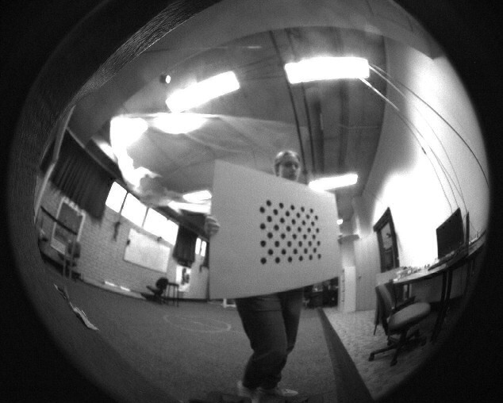
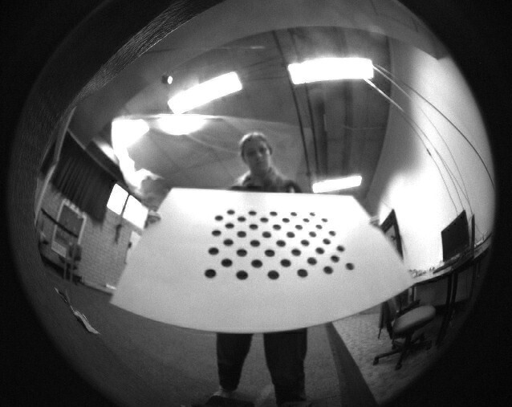
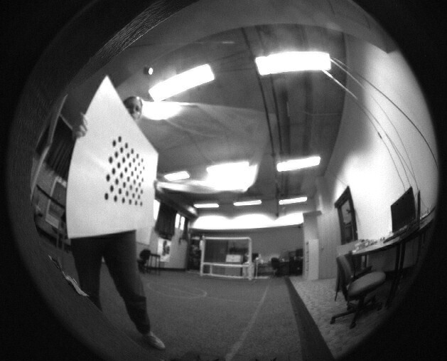
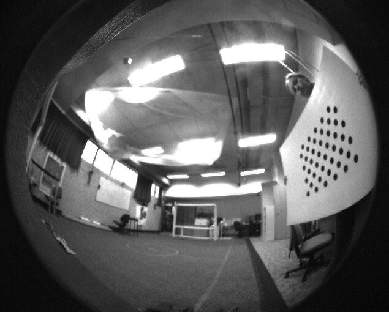

Camera calibration determines optimal parameters for the cameras. These parameters include the focal length and the transform from one camera to the other. More on the parameters being optimised for camera calibration can be found on [the input page](/system/subsystems/input#cameras).

The calibration requires two steps, creating the `nbs` recording and using it to find the camera parameters.

## Get the Data

1.  Change [`test_camera.role`](https://github.com/NUbots/NUbots/blob/main/roles/test_camera.role) to include `support::logging::DataLogging`

2.  Build using `./b build` and then install onto a robot using `./b install n<number>`. More on building can be found on the [Getting Started page](/guides/main/getting-started) or the [Build System page](/system/foundations/build-system).

3.  On the robot, enable compressed image recording in `config/DataLogging.yaml`. Do this by setting `message.output.CompressedImage` to `true`.

4.  Ensure the Left and Right camera serial numbers are correct in their respective configuration files (`Left.yaml` and `Right.yaml`).

    The serial numbers can be retrieved by first running `lsusb` and finding the bus and device numbers for the FLIR/Point Grey cameras. Then run `lsusb -s <bus number>:<device number> -v` to find the serial numbers.

    Next you need to figure out which serial number is left and which is right. Change the serial number for one camera to an incorrect number (this ensures it's not found when running test_camera). Enable `message.output.CompressedImage` in `NetworkForwarder.yaml`. Run `./test_camera` and test which camera is working by covering one camera and seeing the resulting image in the NUsight vision tab. Alternatively, you could unplug one camera rather than change the serial number. If the serial number is on the wrong camera configuration file, switch them.

5.  Check the focus of the lenses using the NUsight vision tab. If it is not sharp, focus the camera. This involves pulling the camera out from the head, still plugged in, and loosening the three grub screws. Twist until the camera is focused.

6.  Check the [transformation matrix](/system/foundations/mathematics#homogeneous-transformations) from the left camera to the pitch motor (Hpc) is correct in the `Left.yaml` file. This should be the transformation matrix from the camera to the end of the rigid body, i.e. the pitch motor as used in forward kinematics. Currently this is 69.952mm in $x$, 33.795mm in $y$, 64.88mm in $z$, and a positive $y$-axis rotation of $2^\circ$. In SI units the matrix is

    $$
    \text{Hpc} = \begin{bmatrix}
    \cos(\frac{2 \pi}{180}) & 0 & \sin(\frac{2 \pi}{180}) & 0.069952 \\
    0 & 1 & 0 & 0.033795 \\
    -\sin(\frac{2 \pi}{180}) & 0 & \cos(\frac{2 \pi}{180}) & 0.06488 \\
    0 & 0 & 0 & 1 \end{bmatrix}
    $$

7.  Run `./test_camera` on the robot and hold up a board as shown in the below image. There is an appropriate board in the NUbots laboratory. Move the board around to cover the robot's view over time, taking into account that the lenses have a $180^{\circ}$ field of view. Move the board around at different distances and angles.

    

    <Grid columns='1fr 1fr' caption="Photos from the robot's cameras of a person moving around a board for camera calibration.">

    

    

    

    

    </Grid>

8.  Stop the binary and copy the `nbs` file created into the NUbots directory on your computer.

    1. To stop the program running, hit <kbd>Ctrl</kbd> + <kbd>c</kbd>.

    2. Discover the name of the log file created. The file is in the `log/test_camera/` folder on the robot. The name corresponds to the date and time it was created, according to the robot. Run `ls log/test_camera/` to list all logs.

    3. (optional) Rename the log file, making it easier to copy across to the computer. Change the name with the command `mv <old path> <new path>`.

    4. Run the command `scp <robot address>:<file path> .` from the NUbots directory on your computer, not on the robot.

    5. The robot can be turned off at this point. The recording you just made should be on your computer in the NUbots directory. Check that it is before continuing to the next section.

## Run the Optimisation

1.  Run the following commands to install the dependencies of the camera calibration tool if you have not done this before

    ```bash
    sudo apt update
    sudo apt install protobuf-compiler libprotobuf-dev
    sudo -H pip3 install --upgrade pip
    sudo -H pip3 install tensorflow opencv-contrib-python ruamel.yaml
    ```

2.  Calibrate the cameras by running

    ```bash
    ./b nbs calibrate_cameras <nbs file name> -c <camera config folder>
    ```

    `<nbs file name>` is the name of the `nbs` file you just created. `<camera config folder>` is the path to the folder with the two camera config files `Left.yaml` and `Right.yaml`. These exist in `./module/input/Camera/data/config/<robot name>/Cameras/`.

    The calibration routine changes the values in the camera configuration files.

3.  Verify these values by running vision and checking the output in NUsight.

    1. Ensure `NetworkForwarder.yaml` has enabled compressed images (`message.output.CompressedImage`) and vision objects.
    2. Stand the robot up with `./scriptrunner Stand.yaml`
    3. Face the robot towards a straight horizontal line, such as a line of bricks on a brick wall.
    4. Run `visualmesh.role` and switch to the vision tab in NUsight

    NUsight should show a blue horizontal line, drawn at a constant height along the wall. If this is the case, then the calibration is verified.

4.  Repeat this process with other robots if needed.

5.  Commit these changes in a new branch on GitHub and make a Pull Request. Read the [Git guide](/guides/general/git) if you are unsure about this step.
