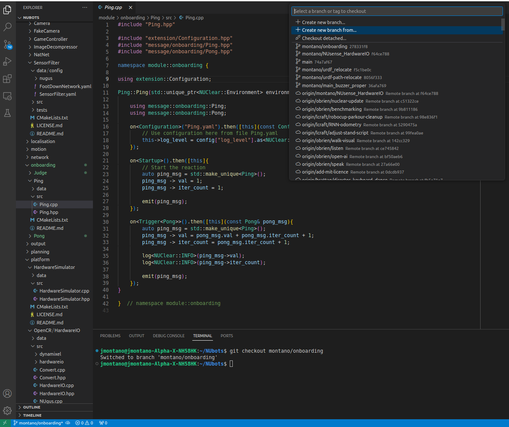
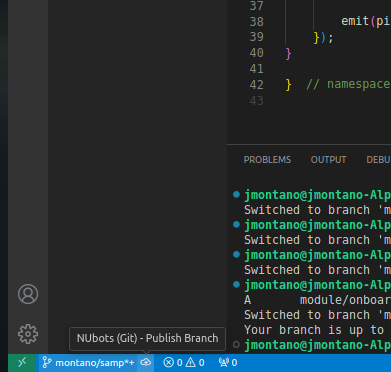
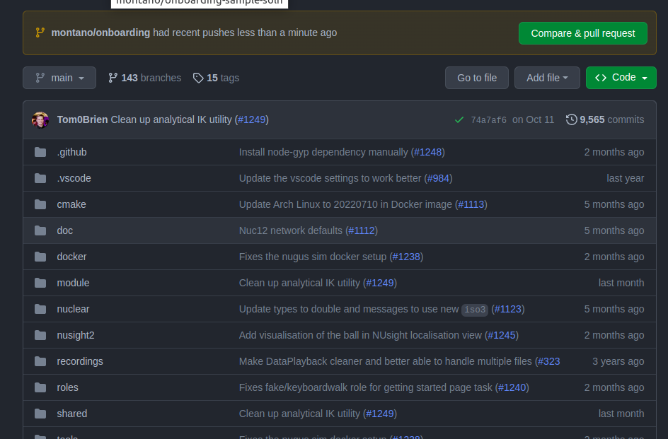
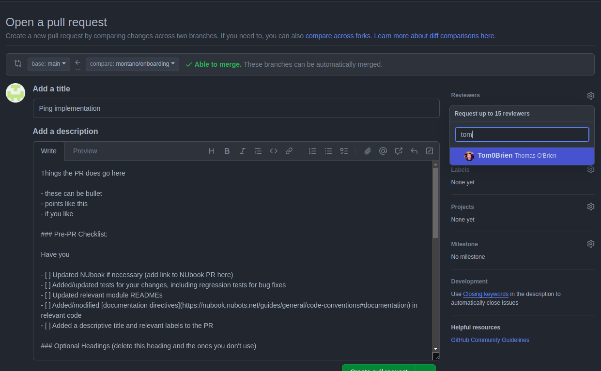
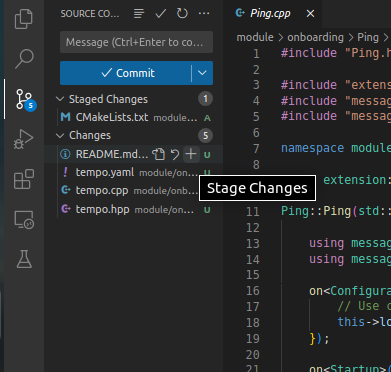

The onboarding workshop aims to teach new members about [NUClear](https://nuclear.readthedocs.io/en/latest/). New members will be asked to engage in coding with C++. Prerequisites such as Git, VS code, etc. must be set up first before moving forward with this task. See the [Getting Started](guides/main/getting-started#page-content) page for more details.

## Terminology

### Role

A **Role** is a file that defines the desired purpose or functionality of the binary/program we want to compile. A role file lists what modules we want included in our program/binary.

This is an example of a role file:

```make
nuclear_role(
  extension::FileWatcher
  support::logging::ConsoleLogHandler
  actuation::KinematicsConfiguration
  platform::${SUBCONTROLLER}::HardwareIO
  input::SensorFilter
  extension::Director
  actuation::Kinematics
  actuation::Servos
  onboarding::Ping
  onboarding::Pong
  onboarding::Judge
)
```

### Messages

A message is called a neutron. It is essentially a `.proto` file. When a role is built, the proto file becomes imported as a `.hpp` file.

For example, the `Ping.proto` file looks like:

```protobuf
syntax = "proto3";

package message.onboarding;

message Ping {
    int32 val = 1;
    int32 iter_count = 2;
}
```

It should be imported as `#include "message/onboarding/Ping.hpp"`. This message can hold a 32-bit integer variable named `val` and `iter_count`. All messages are stored in folder `shared/message`.

### Modules

**Modules** respond to and send information into the system using **messages**. They use the `emit()` function to send messages and `on<DSL<message>>()` functions to respond to them.

Consider the following example `Ping` module:

```cpp
#include "Ping.hpp"

#include "extension/Configuration.hpp"

#include "message/onboarding/Ping.hpp"
#include "message/onboarding/Pong.hpp"

namespace module::onboarding {

    using extension::Configuration;

    Ping::Ping(std::unique_ptr<NUClear::Environment> environment) : Reactor(std::move(environment)) {

        using message::onboarding::Ping;
        using message::onboarding::Pong;

        on<Configuration>("Ping.yaml").then([this](const Configuration& config) {
            // Use configuration here from file Ping.yaml
            this->log_level = config["log_level"].as<NUClear::LogLevel>();
        });

        on<Trigger<Pong>>().then([this](const Pong& pong_msg) {
            auto ping_msg = std::make_unique<Ping>();
            log<NUClear::INFO>("Ping");
            emit(ping_msg);
        });
    }

}  // namespace module::onboarding
```

Let's dive into what's going on within this module:

1.  At the top of a module, we include the necessary header and message files:

    ```cpp
    #include "Ping.hpp"

    #include "extension/Configuration.hpp"

    #include "message/onboarding/Ping.hpp"
    #include "message/onboarding/Pong.hpp"
    ```

2.  Next, the module is defined as a class that inherits from the NUClear environment. It is essentially the module itself:

    ```cpp
    namespace module::onboarding {

        using extension::Configuration;

        Ping::Ping(std::unique_ptr<NUClear::Environment> environment) : Reactor(std::move(environment)) {

            using message::onboarding::Ping;
            using message::onboarding::Pong;
    ```

3.  Within the Pong module are the `on` functions that were mentioned earlier:

    ```cpp
    on<Configuration>("Ping.yaml").then([this](const Configuration& config) {
        // Use configuration here from file Ping.yaml
        this->log_level = config["log_level"].as<NUClear::LogLevel>();
    });

    on<Startup>().then([this] {
        // Vibe
    });

    on<Trigger<Pong>>().then([this](const Pong& pong_msg) {
        auto ping_msg = std::make_unique<Ping>();
        log<NUClear::INFO>("Ping");
        emit(ping_msg);
    });
    ```

    - `on<Configuration>` is used to load in configuration values from file `Pong.yaml`
    - `on<Startup>()` runs just once when the module starts
    - `on<Trigger<Ping>>()` runs when `Ping` message is received and prints "Ping"

<Alert type='info'>

The `log<NUClear::INFO>("Ping");` can be thought of as the equivalent of an `std::cout` in normal C++ or a `print` in python. There are various types that can be used for logging information. See NUbook for more information.

</Alert>

## Task: Git Branching

A branch is your own workspace where you can make changes and implement new features. It is a good practice to create a new branch for each new feature you are working on. This way, you can work on multiple features at the same time without affecting the main codebase.

1.  Open a terminal in your `NUbots` directory and checkout the branch `montano/onboarding` by running

    ```bash
    git checkout montano/onboarding
    ```

    This branch has a role `onboarding.role` and module `Ping` already created for you.

2.  Now crate your own branch which extends from this by running

    ```bash
    git checkout -b <your-last-name>/branching-task
    ```

<Alert type='info'>

Don't be afraid to break things in your own branch! It will not directly impact the `main` branch.

</Alert>

### VSCode Git Extension

There exists many GUI tools for using Git which can make your life easier, for example VSCode, Github Desktop or Git Kraken.

In VScode, you can create your own branch by clicking on the button on the bottom left hand side, which is the name of the branch that you are currently on.

To create a new branch using the VSCode Git extension:

1.  Click on the button in the bottom left hand corner of the screen containing the name of the current branch.

    If you have correctly done the git checkout command, then you should be in the `montano/onboarding` branch.

2.  Select `Create new branch from...` and enter `montano/onboarding`. This will create a new branch starting from the `montano/onboarding` branch.

    

3.  Enter a branch name which should follow convention `<your-last-name>/<branch-name>`, where branch name should be something clear and simple.

## Task: Creating messages and modules

You should see the `Ping` module already implemented in `NUbots/module/onboarding`.

Currently, this code **will not compile** because a `Pong` message doesn't exist, so let's create it.

1. Navigate to `NUbots/shared/message/onboarding`, duplicate `Ping.proto` and rename it and its contents to `Pong`.

   You should have a new file `Pong.proto` in folder `NUbots/shared/message/onboarding` with contents:

   ```protobuf
   syntax = "proto3";

   package message.onboarding;

   message Pong{
   }
   ```

2. Ensure that the code now compiles by running:

   ```bash
   ./b configure --clean
   ./b build
   ```

3. We will now create the `Pong` module which sends out a `Pong` message. Run the following script to generate a template module:

   ```bash
   ./b module generate onboarding/Pong
   ```

4. Navigate to `NUbots/module/onboarding/Pong` and populate the `Pong.cpp` file with the following code and implement the TODO's:

   ```cpp
   #include "Pong.hpp"

   #include "extension/Configuration.hpp"

   #include "message/onboarding/Ping.hpp"
   #include "message/onboarding/Pong.hpp"

   namespace module::onboarding {

       using extension::Configuration;

       Pong::Pong(std::unique_ptr<NUClear::Environment> environment) : Reactor(std::move(environment)) {

           using message::onboarding::Ping;
           using message::onboarding::Pong;

           on<Configuration>("Pong.yaml").then([this](const Configuration& config) {
               // Use configuration here from file Pong.yaml
               this->log_level = config["log_level"].as<NUClear::LogLevel>();
           });

           on<Startup>().then([this] {
               // Start the ping pong chain
               auto pong_msg = std::make_unique<Pong>();
               emit(pong_msg);
           });

           on<Trigger<Ping>>().then([this](const Ping& ping_msg) {
               // TODO: Log a INFO level message with the text "Pong"

               // TODO: Emit a Pong message
           });
       }

   }  // namespace module::onboarding
   ```

5. Add this module to the role file `onboarding.role` located in folder `NUbots/roles/test`. Its contents should then look like:

   ```make
   nuclear_role(
   # FileWatcher, ConsoleLogHandler and Signal Catcher Must Go First. KinematicsConfiguration usually goes after these
   # and without it many roles do not run
   extension::FileWatcher
   # support::SignalCatcher
   support::logging::ConsoleLogHandler
   # This must come first as it emits config which many roles depend on (e.g. SensorFilter, WalkEngine)
   actuation::KinematicsConfiguration
   platform::${SUBCONTROLLER}::HardwareIO
   input::SensorFilter
   extension::Director
   actuation::Kinematics
   actuation::Servos
   onboarding::Ping
   onboarding::Pong
   )
   ```

6. Compile and run the program by running

   ```bash
   ./b configure
   ./b build
   ./b run test/onboarding
   ```

7. Once the code is compiling and you are happy with it, commit and push your changes to the cloud by running

   ```bash
   git add -A                       # Add all changed files to the commit
   git commit -m "Add pong module"  # Commit the changes with a message
   git push                         # Push the changes to the cloud
   ```

<Alert type='warn'>

Reactors are started in the order that is stated in the role file. Suppose that the startup function within Ping contains the initial emit message but it goes before Pong in the role document, the initial message can be emitted before the reactor Pong is initialised.

</Alert>

## Task: Add property to a message

At this point, we have a `Ping` and `Pong` module and their corresponding messages which communicate with one another, however the messages lack any information.

1.  Update the `Ping` message following the template below:

    ```protobuf
    syntax = "proto3";

    package message.onboarding;

    message Ping{
        // TODO: Fill this message with an int32 field named "count". What should its tag be?
        // HINT: Look at the format of other proto messages in the code base for reference.
    }
    ```

<Alert type='info'>

Protocol Buffers (protobuf) is a sophisticated library for serialisation, deserialisation and compression of information. We cannot discuss its entirety here but do note that we treat protobufs as data that gets passed around in the system during runtime.

</Alert>

2.  Update the `Ping` module to increment the counter every time a `Pong` message is received.

3.  Emit this message with the incremented value and display this value using a `log` command within the `Pong` module.

Below is a template of how you might structure the `Ping` module:

```cpp
#include "Ping.hpp"

#include "extension/Configuration.hpp"

#include "message/onboarding/Ping.hpp"
#include "message/onboarding/Pong.hpp"

namespace module::onboarding {

    using extension::Configuration;

    Ping::Ping(std::unique_ptr<NUClear::Environment> environment) : Reactor(std::move(environment)) {

        using message::onboarding::Ping;
        using message::onboarding::Pong;

        on<Configuration>("Ping.yaml").then([this](const Configuration& config) {
            // Use configuration here from file Ping.yaml
            this->log_level = config["log_level"].as<NUClear::LogLevel>();
        });

        on<Trigger<Pong>>().then([this](const Pong& pong_msg) {
            auto ping_msg = std::make_unique<Ping>();
            ping->count = ????; // TODO: Assign counter value.
            log<NUClear::INFO>("Ping");
            emit(ping_msg);
        });
    }

}  // namespace module::onboarding
```

## Task: Create a pull request

This section contains information about how to open a pull request. First, create your branch and name it. It should be in the format of `author(s)/this-code-does-this`. It is ideal to keep it intuitive and simple. Run `git checkout montano/onboarding` to push to this branch before doing anything else. Follow the images below to create a pull request that pushes to the `montano/onboarding` branch in `NUbots/NUbots`.

1. Checkout to the branch that you have created (the one created from `montano/onboarding`). Once in the branch, click the cloud with an arrow pointing up on the bottom left hand side of VS code. If you hover over it, you should be able to see "Publish Branch". Click on it.

   

<Alert type='warn'>

If you were not able to publish your branch successfully, then your write access will need to be given to you by an admin (usually the team leader).

</Alert>

2. Go to the page for the `NUbots/NUbots` repository. A popup with a "Compare and Pull request" button should be visible after successful publishing. Click on it.

   

3. Fill in the details to create a pulll request.

   - Assign a proper name to your pull request. It should be informative and describe exactly what the code aims to do.
   - Add a description to provide more detailed information about the feature.
   - You may assign people to review your code. When contributing to the code base, it is usually ideal to assign your mentors or someone with experience in related features as a reviewer.

   

4. Press the "Create Pull request" when ready. This pull request should now be visible in the pull requests tab in github if done successfully.

5. If needed, you can still commit new changes after making a pull request.

   When committing more changes such as new code or new files, navigate to the source control tab, hover over the files that you would like to commit the changes of, then click the <kbd>+</kbd> button to stage the changes. When you're ready, add an informative commit name and press the Commit button. Then click Sync to push the changes to the cloud.

   

<Alert type='info'>

An easy way to commit and push all your changes to tracked files is to run the following commands in the terminal:

```bash
git commit -am "Descriptive commit message"
git push
```

</Alert>

<Alert type='warn'>

Always remember to push your changes to the cloud after committing them. If you don't, your changes will only remain on your local machine and will not be visible to others.

</Alert>

## Main task

For this task, we aim to evaluate the expression:

$$
\sum_{k=1}^{n} k
$$

where n is the number of iterations, and define it as $n:=10$. Note that evaluating this expression is trivial, as one can implement the shortcut by using $n(n+1)/2$ or using an iterative algorithm instead, but that wouldn't help you to get familiar with the NUbots codebase! As such, we will be introducing requirements and constraints.

**Requirements**

1. The code must be written in C++, using NUClear.

2. The code must be compiled and installed into a robot.

3. Once the right answer has been derived, one must emit that answer. If the correct answer was emitted, the robot should nod yes.

4. You must use at least 3 modules to implement their solutions.

   - Why at least 3 modules? One will start the reaction, one will determine when to stop sending the message to the other reactor and start emitting the final answer, and one will process the final answer and send the NodYes command.
   - Decoupling is very important for code reliability and robustness. It also helps to make your code easy to review.

5. You must make your own branch and submit your code as a pull request for review once finished.

**Constraints**

1. You cannot use a `for` loop or a `while` loop to evaluate the expression.

2. You cannot use the proposed $n(n+1)/2$ shortcut to evaluate the expression

3. Only `on<Trigger<...>>` and `emit()` statements can be used.

**Recommendations**

- Use `./b module generate <absolute module path and name>` to generate your modules. A full path example could be something like `test/onboarding_task`.

- Use the NUClear role from the start for this task and a starting point. It looks like

  ```make
  nuclear_role(
  extension::FileWatcher
  support::logging::ConsoleLogHandler
  actuation::KinematicsConfiguration
  platform::${SUBCONTROLLER}::HardwareIO
  input::SensorFilter
  extension::Director
  actuation::Kinematics
  actuation::Servos
  onboarding::Ping
  onboarding::Pong
  onboarding::Judge
  )
  ```

- They say that naming things is one of the hardest tasks in software engineering. What should the names of your modules be? Should they still be Ping and Pong? Can you think of more suitable names? What about your the names of your messages, i.e., your `.proto` files?

- NUbook will have all the information you need, and then some. This task cannot explain NUClear in its full glory, but it should be enough to enable members to contribute to the code base as soon as possible. If you wish to know more, you must learn to read documentation and if you are still stuck, don't hesitate to ask questions.

<Alert type='info'>

When in VS code, press <kbd>CTRL</kbd> + <kbd>Shift</kbd> + <kbd>F</kbd> to find code snippets. This is particularly useful if members want to know how a specific bit of code should be used or how it is implemented. This will be specifically useful when looking at where to put your files in. For example, proto messages should lie in `~/NUbots/shared/messages/...` and modules should lie within `~/NUbots/modules`.

</Alert>

Once the code writing activity is finished, ask an experienced team member for assistance in [flashing the robot with your compiled binaries](guides/main/getting-started#running-on-a-real-robot). This will require a `./b install n<nugus id>` followed by `ssh nubots@10.1.1.<nugus id>` and then running the binary by entering `./test/onboarding`.
