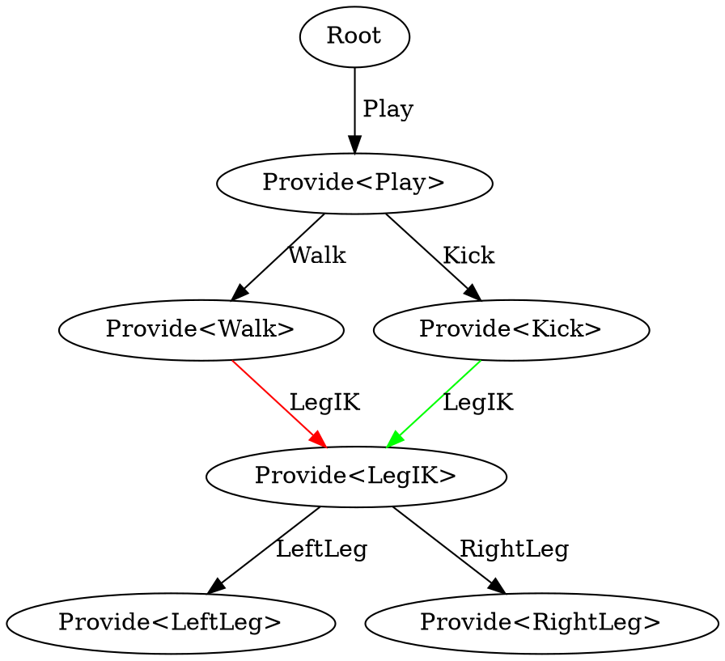

The Director is the framework that controls behaviour flow on the robot. It decides which Tasks get to run, which Providers get to run them, and how competing goals are resolved. This workshop builds that understanding piece by piece, by growing a small set of NUClear modules, wired together with a role file.

## Prerequisites

This workshop assumes you have already completed the [Onboarding Workshop](/guides/main/onboarding) and are comfortable with NUClear reactors, `on` statements, `emit`, `.proto` messages and role files.

Keep the [Director](/system/foundations/director) page open in another tab as you work through this. It explains the concepts in detail; this workshop is where you put them into practice. Where useful, sections below point back to specific parts of that page.

## How This Workshop Works

You'll build a tiny simulated behaviour system, following the `purpose` / `skill` / `actuation` layering described in the Director page's [Behaviours Layout](/system/foundations/director#behaviours-layout) section:

- `Play` (purpose) decides what the robot should be trying to do.
- `Walk` and `Kick` (skill) are two things the robot might do, and both need control of the legs.
- `Legs` (actuation) "moves" `LeftLeg` and `RightLeg` — simulated with a `log<INFO>` and, later, a Director `Wait`.

Each of these three components is a module generated with `./b module generate <path> --director`, and they're all included in one role file that grows over the course of the workshop. Every module logs what it's doing with `log<INFO>`, so running the role and reading the console is how you'll observe the Director's behaviour.

A lot of the "what if this changes?" experiments below are driven by editing a module's config **while the role is still running**, since `extension::FileWatcher` re-triggers the matching `on<Configuration>` reaction the moment a config file changes. You're running inside Docker though, so editing the source `.yaml` under `module/.../data/config/` won't reach the running program — that copy is only picked up on your next `./b build`. Instead, use

```bash
./b edit config/Play.yaml
```

which opens the _build tree's_ copy directly inside the container in `nano` (save with <kbd>CTRL</kbd> + <kbd>O</kbd> then <kbd>Enter</kbd>). Changes take effect immediately, but aren't persistent — a later `./b build` overwrites it with whatever's checked into `data/config/Play.yaml`. That's fine for this workshop; you're only editing config to poke at already-running behaviour.

<Alert type='info'>

The module `Director/tests/` folder has an automated test for almost everything covered here (`simple_task.cpp`, `priority_steal.cpp`, `done_task.cpp`, `needs_blocking.cpp`, `when_blocking.cpp`, `wait_task.cpp`, and more). If you get stuck, tests are a good way to learn how to implement various Director functionalities.

</Alert>

## Task: Setup the Files

1. In your `NUbots` repository, create a new branch for this workshop:

   ```bash
   git checkout -b <your-last-name>/director-workshop
   ```

2. Create the messages for the modules. Make `shared/message/director_workshop/DirectorWorkshop.proto`:

   ```protobuf
   syntax = "proto3";

   package message.director_workshop;

   message Play {}
   message Walk {}
   message Kick {}
   message LegIK {
       // Which skill currently has control, so Legs can report who it's moving for
       string owner = 1;
   }
   message LeftLeg {}
   message RightLeg {}
   ```

   Generally, only conceptually similar messages are grouped into a single file. In this workshop, we use one file for simplicity. You may choose to separate them.

3. Generate four Director modules:

   ```bash
   ./b module generate director_workshop/Play --director
   ./b module generate director_workshop/Walk --director
   ./b module generate director_workshop/Kick --director
   ./b module generate director_workshop/Legs --director
   ```

   This command creates a module with all the required boilerplate, including the ability to easily use the Director framework by extending the class from `BehaviourReactor` rather than a simple `NUClear::Reactor`.

4. Fill in `module/director_workshop/Walk/src/Walk.cpp`:

   ```cpp
   #include "Walk.hpp"

   #include "extension/Behaviour.hpp"
   #include "extension/Configuration.hpp"

   #include "message/director_workshop/DirectorWorkshop.hpp"

   namespace module::director_workshop {

       using extension::Configuration;
       using message::director_workshop::LegIK;
       using WalkMsg = message::director_workshop::Walk;  // to prevent a name clash with the class

       Walk::Walk(std::unique_ptr<NUClear::Environment> environment) : BehaviourReactor(std::move(environment)) {

           on<Configuration>("Walk.yaml").then([this](const Configuration& config) {
               this->log_level = config["log_level"].as<NUClear::LogLevel>();
           });

           on<Provide<WalkMsg>>().then([this] {
               log<INFO>("walk running");
               emit<Task>(std::make_unique<LegIK>("walk"));
           });
       }

   }  // namespace module::director_workshop
   ```

5. Fill in `Kick.cpp` similarly to `Walk.cpp` (including the same naming workaround — `Kick` the message and `Kick` the class clash too), logging `"kick running"` and using `"kick"` as the `LegIK` owner.

6. Fill in `Legs.cpp`. It provides `LegIK` and reports who's currently asking for it:

   ```cpp
   #include "Legs.hpp"

   #include "extension/Behaviour.hpp"
   #include "extension/Configuration.hpp"

   #include "message/director_workshop/DirectorWorkshop.hpp"

   namespace module::director_workshop {

       using extension::Configuration;
       using message::director_workshop::LegIK;

       Legs::Legs(std::unique_ptr<NUClear::Environment> environment) : BehaviourReactor(std::move(environment)) {

           on<Configuration>("Legs.yaml").then([this](const Configuration& config) {
               this->log_level = config["log_level"].as<NUClear::LogLevel>();
           });

           on<Provide<LegIK>>().then([this](const LegIK& leg_ik) {  //
               log<INFO>("legs moving, owner:", leg_ik.owner);
           });
       }

   }  // namespace module::director_workshop
   ```

7. `Play` is the one non-Provider reaction that kicks everything else off, and the one you'll edit config for throughout this workshop. Add a small config struct to `Play.hpp`, in place of the empty `Config` struct the generator gave you:

   ```cpp
   struct Config {
       bool kick_enabled = false;
       int kick_priority = 1;
   } cfg;
   ```

   Add `#include "message/director_workshop/DirectorWorkshop.hpp"` to `Play.hpp`.

   Fill in `Play.cpp`:

   ```cpp
   #include "Play.hpp"

   #include "extension/Behaviour.hpp"
   #include "extension/Configuration.hpp"

   #include "message/director_workshop/DirectorWorkshop.hpp"

   namespace module::director_workshop {

       using extension::Configuration;
       using message::director_workshop::Kick;
       using message::director_workshop::Walk;
       using PlayMsg = message::director_workshop::Play;  // to prevent a name clash with the class

       Play::Play(std::unique_ptr<NUClear::Environment> environment) : BehaviourReactor(std::move(environment)) {

           on<Configuration>("Play.yaml").then([this](const Configuration& config) {
               this->log_level   = config["log_level"].as<NUClear::LogLevel>();
               cfg.kick_enabled  = config["kick_enabled"].as<bool>();
               cfg.kick_priority = config["kick_priority"].as<int>();

               // Re-request Play so Provide<PlayMsg> below runs again with the new configuration
               emit<Task>(std::make_unique<PlayMsg>());
           });

           on<Provide<PlayMsg>>().then([this] {
               log<INFO>("play running");

               emit<Task>(std::make_unique<Walk>(), 10);

               if (cfg.kick_enabled) {
                   emit<Task>(std::make_unique<Kick>(), cfg.kick_priority);
               }
           });
       }

   }  // namespace module::director_workshop
   ```

   Fill in `Play.yaml`:

   ```yaml
   log_level: INFO
   kick_enabled: false
   kick_priority: 1
   ```

8. Create `roles/test/director_workshop.role`:

   ```make
   # Director Workshop
   nuclear_role(
     extension::FileWatcher # Watches configuration files for changes
     support::SignalCatcher # Allows for graceful shutdown
     support::logging::ConsoleLogHandler # `log()` calls show in the console filtered for log level

     extension::Director

     director_workshop::Play
     director_workshop::Walk
     director_workshop::Kick
     director_workshop::Legs
   )
   ```

9. Configure, build and run:

   ```bash
   ./b configure
   ./b build
   ./b run test/director_workshop
   ```

   You should see `play running`, `walk running` and `legs moving, owner: walk` logged once — nothing else is happening yet. Leave it running; you'll come back to it for the rest of this section. Press <kbd>CTRL</kbd> + <kbd>C</kbd> whenever you want to stop it.

   <Alert type='warn'>

   Whenever you add a **new** `.proto` file, module or role file, CMake needs to be told about it before `ninja` will pick it up. Re-run `./b configure` (then `./b build`) any time you add one. Editing an _existing_ file's contents doesn't need a reconfigure, just a rebuild.

   </Alert>

## Tasks and Providers

Read the [Providers](/system/foundations/director#providers) and [Tasks](/system/foundations/director#tasks) sections of the Director page before starting this section.

The two core ideas:

- A **Provider** is a reaction declared with `on<Provide<T>>()`. It is what actually performs a Task of type `T`. `Walk`, `Kick` and `Legs` are all Providers for their respective Task types.
- A **Task** is requested with `emit<Task>(std::make_unique<T>())`, optionally with a priority, an optional flag, and a name (in that order).

### Root Tasks vs Subtasks

A Task emitted from a reaction that is **not** itself a Provider is a **root Task**. A Task emitted from inside a Provider reaction is a **subtask**, and becomes a child of that Provider in the Director's graph.

Look back at `Play.cpp`: `Play` itself is emitted from the `on<Configuration>` reaction, which is not a Provider — so `Play` is a **root Task**. `Walk` and `Kick`, emitted from inside `on<Provide<PlayMsg>>`, are **subtasks** of `Play`. `LegIK`, emitted from inside `on<Provide<WalkMsg>>` and `on<Provide<Kick>>`, is in turn a subtask of whichever of those is currently in control. This is exactly the tree from the reference page's Director Graph example:



With your role still running, `./b edit config/Play.yaml` and set `kick_enabled: true`. Predict what you'll see logged before you save.

<details>
<summary>Answer</summary>

`play running` and, for the first time, `kick running` — the tree only has a `Kick` node at all while `Play` is actually requesting it, since it's a subtask. `walk running` and `legs moving, owner: walk` also log again, even though nothing about `Walk` changed.

That's worth pausing on: `Provide<PlayMsg>` unconditionally re-emits `Walk` every single time it runs, and a subtask's Provider reruns whenever it's freshly re-emitted — whether or not anything about the request actually changed underneath it. This holds for the rest of the workshop: `walk running` and `legs moving` are going to reappear on **every** edit you make to `Play.yaml`, no matter which field you touch, until you fix this with `Continue`.

</details>

### Priority

Read the [Priority](/system/foundations/director#priority) section of the Director page.

`Walk` and `Kick` are siblings — their closest common ancestor is `Play` — so when they both want `LegIK`, `Play`'s own priority values for them decide the winner. `Walk` is always requested at priority `10`; `Kick`'s priority comes from `Play.yaml`'s `kick_priority`.

With `kick_enabled: true` still set, try each of these in `Play.yaml` via `./b edit`, saving after each change, and predict what `owner` `legs moving` will report before you look:

- `kick_priority: 1` (its default — lower than `Walk`'s `10`)
- `kick_priority: 20` (higher than `Walk`'s `10`)
- `kick_priority: 1` again

<details>
<summary>Answer</summary>

`legs moving, owner: walk` for the first and third, and `legs moving, owner: kick` for the second — `Kick`'s Provider only wins control of `LegIK` while its priority beats `Walk`'s fixed `10`. `kick running` itself keeps logging every time regardless, since `Kick`'s own Provider doesn't care whether it actually won `LegIK` or not.

</details>

<Alert type='info'>

To remove a root Task entirely, rather than a subtask simply not being requested, emit it with `std::unique_ptr<T>(nullptr)` (note: **not** `std::make_unique`) — for example `emit<Task>(std::unique_ptr<PlayMsg>(nullptr))` from a non-Provider reaction would remove `Play`, and everything under it, from the Director's tree completely.

</Alert>

Once you're confident with `Walk` vs `Kick`, have a look at `equal_first_best.cpp` in the tests folder and predict what happens when two root Tasks are given the _same_ priority.

## Using and Run Reason

Now that Providers can be triggered in several different ways (a fresh Task, losing/gaining control, a subtask finishing), it's easy to lose track of _why_ a Provider just ran.

Read the [Run Reason](/system/foundations/director#run-reason) and [Uses](/system/foundations/director#uses) sections of the Director page.

Add a `RunReason` parameter and a decoding helper to `Legs.cpp`'s `Provide<LegIK>`:

```cpp
std::string decode_reason(const RunReason& reason) {
    switch (reason) {
        case RunReason::NEW_TASK: return "NEW_TASK";
        case RunReason::STARTED: return "STARTED";
        case RunReason::STOPPED: return "STOPPED";
        case RunReason::SUBTASK_DONE: return "SUBTASK_DONE";
        case RunReason::PUSHED: return "PUSHED";
        case RunReason::OTHER_TRIGGER: return "OTHER_TRIGGER";
        default: return "UNKNOWN";
    }
}
```

```cpp
on<Provide<LegIK>>().then([this](const LegIK& leg_ik, const RunReason& reason) {
    log<INFO>("legs moving, owner:", leg_ik.owner, "reason:", decode_reason(reason));
});
```

Note that `RunReason` is just a normal callback parameter, not something added to the `on<Provide<LegIK>>()` DSL list — it can sit alongside the Task's own data in whatever order you like, NUClear matches parameters by type. Rebuild, rerun, and toggle `kick_priority` between `1` and `20` in `Play.yaml` again as you did above. Watch the reason `Legs` reports on each edit, whether or not the `owner` actually changes. Does the reason ever differ, or is it the same every time?

<details>
<summary>Answer</summary>

It's `NEW_TASK` every time, whether or not the `owner` actually changes — from `Legs`' point of view, any (re)assignment of `LegIK` looks the same. `RunReason` distinguishes things like `STARTED`/`STOPPED`/`SUBTASK_DONE`, not "is this genuinely new content".

</details>

Now add `Uses<LegIK>` to `Walk`'s Provider so it can tell whether it currently has control:

```cpp
on<Provide<WalkMsg>, Uses<LegIK>>().then([this](const Uses<LegIK>& legs) {
    std::string state = legs.run_state == RunState::RUNNING   ? "RUNNING"
                         : legs.run_state == RunState::QUEUED  ? "QUEUED"
                                                                : "NO_TASK";
    log<INFO>("walk running, LegIK state:", state);
    emit<Task>(std::make_unique<LegIK>("walk"));
});
```

Set `kick_priority: 20` again. `Walk`'s Provider still runs (it's still a requested subtask of `Play`), but predict what `run_state` it will report for `LegIK` while `Kick` has taken it.

<details>
<summary>Answer</summary>

`QUEUED` — `Walk` is still requesting `LegIK`, but a higher priority Provider currently owns it.

</details>

## Done and Continue

Read the [Done Tasks](/system/foundations/director#done-tasks) and [Continue Tasks](/system/foundations/director#continue-tasks) sections of the Director page.

Give `LegIK` two children in `Legs.cpp`, `LeftLeg` and `RightLeg`, that each log and immediately report they're finished:

```cpp
on<Provide<LeftLeg>>().then([this] {
    log<INFO>("left leg moved");
    emit<Task>(std::make_unique<Done>());
});
on<Provide<RightLeg>>().then([this] {
    log<INFO>("right leg moved");
    emit<Task>(std::make_unique<Done>());
});
```

Now rework `Provide<LegIK>` so it requests both of them — but only when that's actually warranted.

<Alert type='warn'>

If you just unconditionally re-request `LeftLeg`/`RightLeg` on every run, watch what happens once they immediately report `Done` back. Keep <kbd>CTRL</kbd> + <kbd>C</kbd> handy.

</Alert>

<details>
<summary>Answer</summary>

```cpp
on<Provide<LegIK>>().then([this](const LegIK& leg_ik, const RunReason& reason) {
    if (reason == RunReason::SUBTASK_DONE) {
        log<INFO>("legs finished moving, owner:", leg_ik.owner);
        emit<Task>(std::make_unique<Continue>());
    }
    else {
        log<INFO>("legs starting to move, owner:", leg_ik.owner);
        emit<Task>(std::make_unique<LeftLeg>());
        emit<Task>(std::make_unique<RightLeg>());
    }
});
```

`LegIK` is re-run, not removed, once its children report `Done` — once per `Done`, so twice for two legs. Unconditionally re-emitting `LeftLeg`/`RightLeg` on every one of those reruns re-triggers them even though nothing changed (as you saw in the previous section), which immediately re-reports `Done`, which reruns `LegIK` again, which re-emits them again... `Continue` breaks that cycle: it tells the Director "nothing has changed, don't touch my subtasks".

</details>

## Provider Groups, Start, Stop and Provide

Read the [Provider Groups](/system/foundations/director#provider-groups) and [Provider Types](/system/foundations/director#provider-types) sections of the Director page.

There are three Provider types for a given Task:

- `Start<T>` runs once, when the Provider group goes from having no active Task to having one.
- `Provide<T>` is the one you've been using — it runs whenever the Task needs (re-)executing.
- `Stop<T>` runs once, when the Provider group goes from having an active Task to having none.

`Kick` is a good place to see this, since `Play` only requests it some of the time. Add these to `Kick.cpp`:

```cpp
on<Start<KickMsg>>().then([this] { log<INFO>("kick started"); });
on<Stop<KickMsg>>().then([this] { log<INFO>("kick stopped"); });
```

Rebuild, then with the role running, toggle `kick_enabled` between `false` and `true` in `Play.yaml` a couple of times. Predict the order `kick started`, `kick running` and `kick stopped` will appear in relative to your edits.

<details>
<summary>Answer</summary>

`kick started` fires once, the first time `Kick` gains control; `kick running` on every run after that while it's active; `kick stopped` once, when `Play` stops requesting it. Matches `start_stop.cpp` in the tests folder. A `Stop` Provider never runs unless a `Start` or `Provide` ran first for that Task — you can't clean up a Provider group that was never active.

</details>

## Needs and When

Read the [Needs](/system/foundations/director#needs) and [When](/system/foundations/director#when) sections of the Director page.

### Needs

`Needs<T>` makes a Provider **refuse to run at all** unless it can take control of `T`, rather than running regardless and having a silently ignored request.

Add `Needs<LegIK>` to `Kick.cpp`:

```cpp
on<Provide<KickMsg>, Needs<LegIK>>().then([this] {
```

`Walk.cpp` already declares `Uses<LegIK>` from an earlier section — since `Needs<T>` extends `Uses<T>`, swap it out rather than adding both:

```cpp
on<Provide<WalkMsg>, Needs<LegIK>>().then([this](const Uses<LegIK>& legs) {
```

Rebuild, set `kick_enabled: true` and `kick_priority: 1` (lower than `Walk`'s `10`). Predict what happens to `kick running` now that `Kick` `Needs<LegIK>`, compared to how it behaved before.

<details>
<summary>Answer</summary>

It stops logging. Before `Needs`, `Kick`'s Provider ran regardless of whether it actually won `LegIK` — the request was just silently ignored. With `Needs<LegIK>`, `Kick` refuses to run at all unless it can take control. Set `kick_priority: 20` and it runs again.

</details>

### When and Provider Groups

A **Provider group** is what you get when more than one Provider is declared for the same Task type — only one member is ever active at a time. `When<State, expr, value>` is usually how you'd choose between them, blocking a Provider unless a condition on some globally emitted state is true.

Add an `Obstacles` enum to your `.proto` file:

```protobuf
enum Obstacles {
    FEW  = 0;
    MANY = 1;
}
```

Add an `obstacles` field to `Play`'s config, and broadcast it as state with a plain `emit` (not `emit<Task>`) from `Provide<PlayMsg>`.

Generate one more module, `CautiousWalk`, with a **second** Provider for `Walk`, gated by `When`:

```bash
./b module generate director_workshop/CautiousWalk --director
```

```cpp
on<Provide<Walk>, When<Obstacles, std::equal_to, Obstacles::MANY>>().then([this] {
    log<INFO>("cautious walk running");
    emit<Task>(std::make_unique<LegIK>("cautious walk"));
});
```

`Walk` (no condition — the fallback/default member) and `CautiousWalk` (only valid `When` there are `MANY` obstacles) now form a genuine two-module Provider group. Add `director_workshop::CautiousWalk` to your role file, **listed before** `director_workshop::Walk`.

Reconfigure (it's a new module) and rebuild. With `kick_enabled: false` (so `Kick` isn't muddying the log), predict which of `walk running` / `cautious walk running` you'll see for `obstacles: FEW` and for `obstacles: MANY`.

<details>
<summary>Answer</summary>

`FEW`: only `walk running` (`CautiousWalk`'s condition fails). `MANY`: `cautious walk running` — when more than one Provider in a group could validly run at the same time, the one whose reactor was **constructed first** wins, which for two separate modules means whichever is listed first in the role file. Both `CautiousWalk` (condition met) and `Walk` (no condition, always valid) are simultaneously valid when `obstacles: MANY`. Try swapping their order in `roles/test/director_workshop.role`, reconfiguring and rebuilding, to see the winner change.

</details>

## Wait Tasks

Read the [Wait Tasks](/system/foundations/director#wait-tasks) section of the Director page.

So far `LeftLeg` and `RightLeg` have reported `Done` instantly, which isn't very realistic — a real servo Provider would request the movement once, `Wait` until it should be finished, then check and emit `Done`. Update both in `Legs.cpp` to request a roughly one second `Wait` instead, using `RunReason` to tell whether you're handling a fresh request or waking back up from that `Wait`.

Rebuild, rerun, and trigger a `LegIK` handover (toggle `kick_priority` as before) — because this is a real running program rather than a test with a simulated clock, you can just time how long it takes between `left leg moving` and `left leg finished` directly.

Before that, predict what `RunReason` `LeftLeg`'s Provider will have when the `Wait` elapses and it runs again — none of the values you've met so far are really "a timer fired".

<details>
<summary>Answer</summary>

`OTHER_TRIGGER`.

Also worth knowing: try not to edit `Play.yaml` again while a leg is mid-`Wait` for your timing check. `Walk`/`Kick` freshly re-emit `LegIK` on every single edit, which freshly re-emits `LeftLeg`/`RightLeg` in turn — and re-emitting a Task with a pending `Wait` cancels it early. That's not a bug, it's the exact cancellation rule from the reference page, and worth deliberately triggering once you've confirmed the normal one-second timing.

</details>

Finally, without changing any code, read `wait_task_cancel.cpp` and `wait_task_cancel_trigger.cpp` in the tests folder and answer: if a Provider with a pending `Wait` is re-run for some unrelated reason and emits neither a new `Wait` nor a `Continue`, what happens to the original `Wait`?

## Challenge: Put It All Together

Add one more competing behaviour from scratch, exercising everything above at once: a `GetUp` skill that always wins, no matter what `Walk` or `Kick` are doing.

1. Add a `GetUp` message to `shared/message/director_workshop/DirectorWorkshop.proto`, and generate a new module for it. It'll need the same message/class naming workaround as `Play`, `Walk` and `Kick`.
2. Give it its own `fallen: false` config field. In its `on<Configuration>` reaction, emit `GetUp` as a **root Task** at a very high priority (say `1000`) when `fallen` is true, and remove it with `nullptr` when `fallen` is false.
3. Give `GetUp` a `Provide<GetUp>, Needs<LegIK>` reaction that logs and requests `LegIK` (with `"get up"` as the owner), plus `Start`/`Stop` logging.
4. Add it to your role file, reconfigure, and rebuild.
5. With your role running and `Walk` and/or `Kick` already controlling `LegIK`, set `fallen: true`. Confirm that `legs moving` immediately reports `owner: get up`, regardless of what `kick_priority` or `obstacles` are currently set to — then set `fallen: false` again and confirm control returns to whichever of `Walk`/`Kick`/`CautiousWalk` should have it.

If you can explain, from what you've learned in this workshop, exactly which Director rule causes each log line you see while flipping `fallen` on and off, you're done.

## Where To Go From Here

This workshop only briefly touched on the `optional` flag on `emit<Task>`. It's covered on the [Director](/system/foundations/director) reference page, along with the full [Behaviours Layout](/system/foundations/director#behaviours-layout) conventions (`purpose`, `strategy`, `planning`, `skill`, `actuation`) this workshop's module layout was modelled on.

Once you're comfortable, the best next step is to read a real behaviour module in `module/purpose`, `module/strategy`, `module/planning` or `module/skill` and see these same patterns in production code. Ask a mentor to point you at one relevant to whatever you'll be working on.

`module/director_workshop`, `shared/message/director_workshop` and `roles/test/director_workshop.role` were just for your own practice — feel free to delete them, or keep them around as a reference. If you'd like feedback on your Challenge solution, follow the same branch and pull request process from the [Onboarding Workshop](/guides/main/onboarding#task-create-a-pull-request) and ask a mentor to review it.
