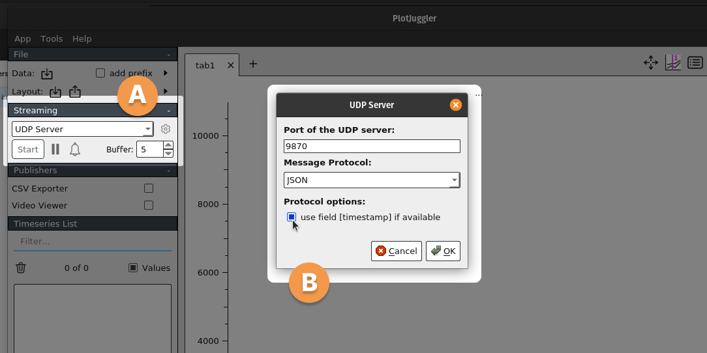

Information on how to set up and use PlotJuggler with NUbots can be found below. This guide walks you through installation, configuration, and usage of PlotJuggler to visualize data in real-time using UDP messages from NUbots.

## Setting Up PlotJuggler

1. [Download and install PlotJuggler](https://github.com/facontidavide/PlotJuggler#installation). The installation instructions provide binaries for multiple operating systems. Follow the instructions for your system.

2. Launch PlotJuggler and start the UDP server:

   A. In the PlotJuggler UI, navigate to the **Streaming** section on the left sidebar.

   B. Select **UDP Server** and click **Start**.

   C. A window will pop up. Enter a port number of your choice, choose "JSON" as the **Message Protocol**, and check the box to use the timestamp field if available. Take note of the port and click **OK**.

   

## Configuring the NUbots Codebase

1. Add the `network::PlotJuggler` module to the role you are working on in NUbots. This module listens for `DataPoint` messages and sends them to PlotJuggler.

2. Update the `PlotJuggler.yaml` configuration file to enable data forwarding and set the appropriate IP address and port:

   - Set `forward_datapoints` to `true` to allow data to be sent to PlotJuggler.
   - Under the `udp_server` section, set `ip_address` to the address of the computer running PlotJuggler (or `127.0.0.1` if running locally), and set `port` to match the port you entered in PlotJuggler.

   Example `PlotJuggler.yaml`:

   ```yaml
   forward_datapoints: true
   udp_server:
     ip_address: '127.0.0.1'
     port: 9876
   ```

## Plotting Data in Your Code

To send data to PlotJuggler from your role:

1. Include the `graph()` helper from the `utility/nusight/NUhelpers.hpp` file:

   ```cpp
   #include "utility/nusight/NUhelpers.hpp"
   using utility::nusight::graph;
   ```

2. Plot data using the `graph()` function and `emit()` the result:

   - To plot a single value:

     ```cpp
     emit(graph("Distance to ball", distance_to_ball));
     ```

   - To plot multiple values:

     ```cpp
     emit(graph("Gyro", my_gyro_data.x(), my_gyro_data.y(), my_gyro_data.z()));
     ```

     For more than four values, the values will be automatically labeled `s0`, `s1`, `s2`, and so on.

3. Build and run your role. Data will appear in the PlotJuggler sidebar while the role is running. You can drag and drop the data points from the sidebar into the graph area to visualize them.

## Troubleshooting

- Ensure the UDP server in PlotJuggler is running and configured correctly.
- Verify that `PlotJuggler.yaml` has the correct IP address and port.
- To check if the connection works, you can set `send_debug_waves` to `true` in the config file to send test data to PlotJuggler:

  ```yaml
  send_debug_waves: true
  ```

This will allow you to verify the connection before plotting real data.
