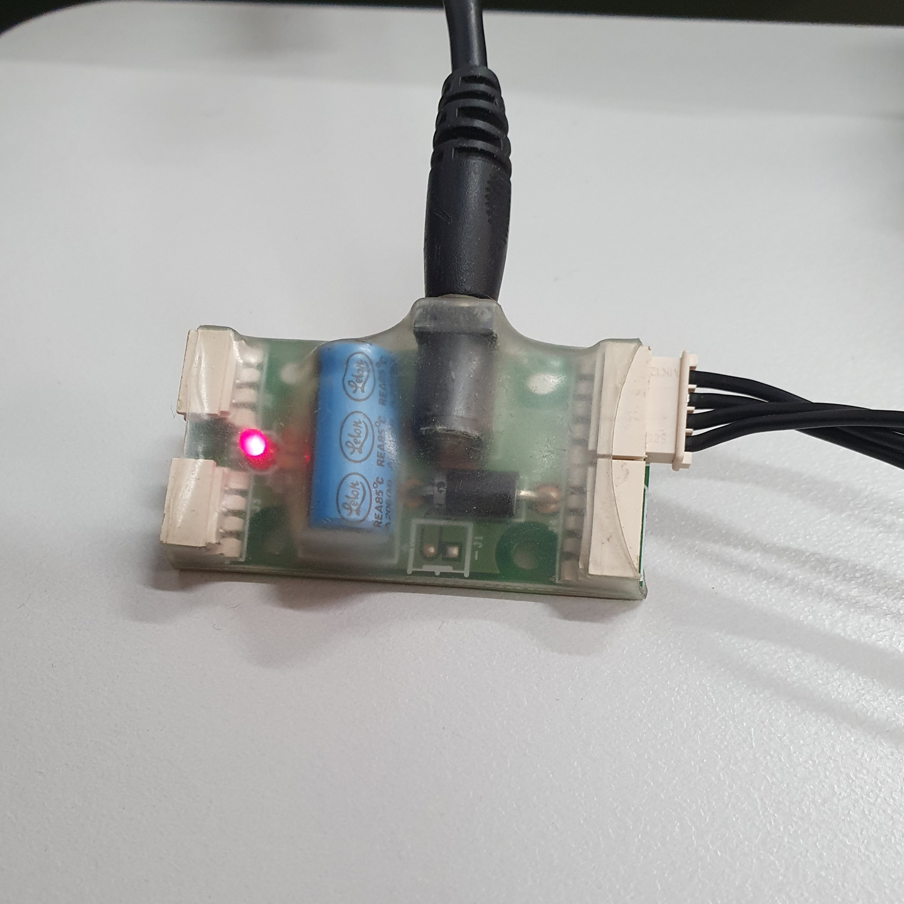
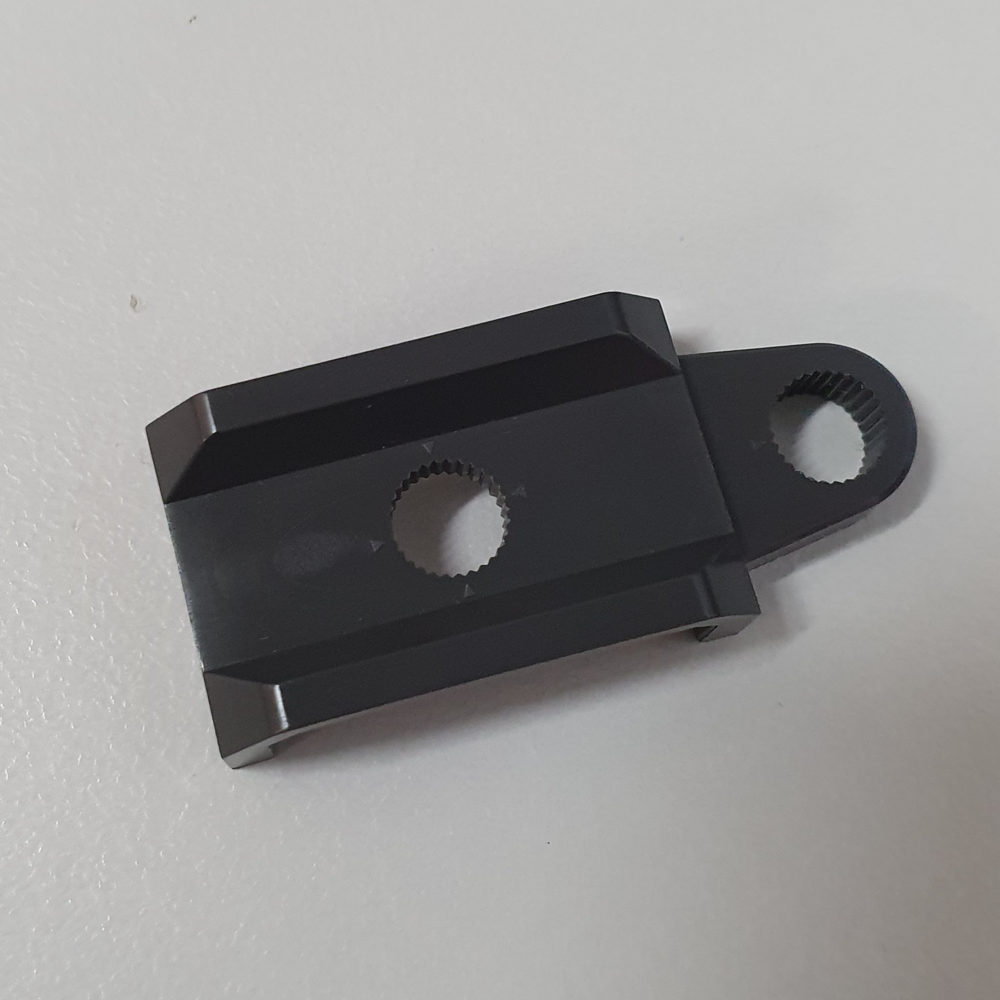
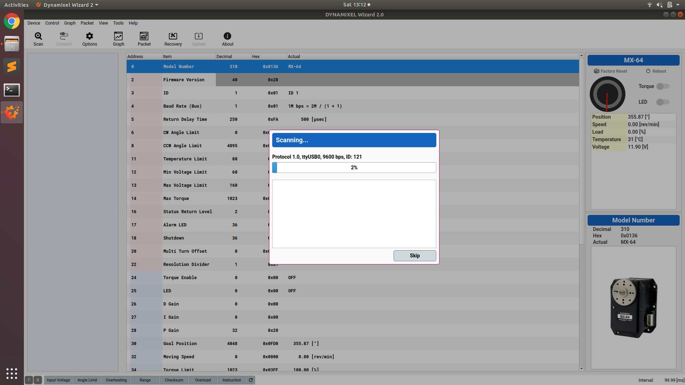
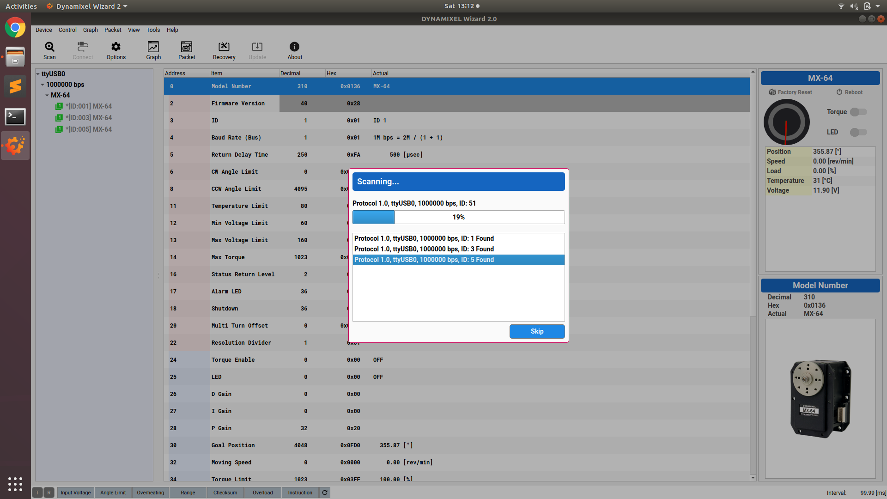
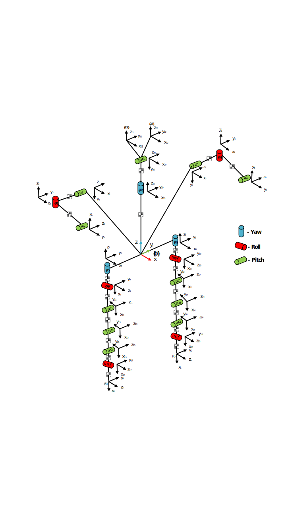
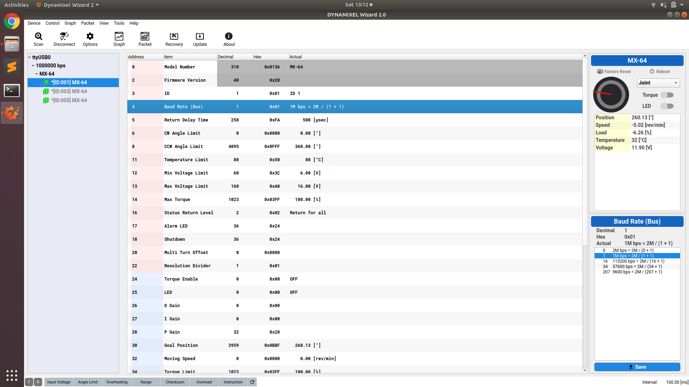
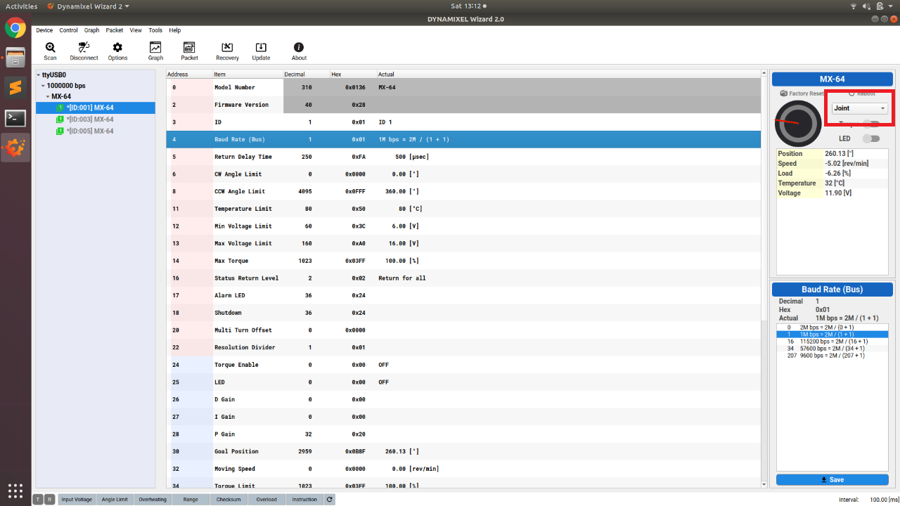
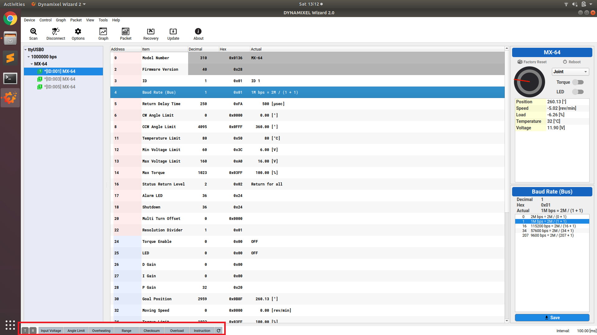

Servos are electromechanical components that allow for the precise control and positioning of the various limbs attached to the NUgus robot. Usually, when a servo is found to not be performing correctly (i.e. seizing or a crunching sound can be heard), it should be removed and replaced with a new servo.

Before a servo is first used, its default parameters need to be updated to ensure correct operation. This is done using Dynamixel Wizard, which can be installed via a Windows .exe here: [Dynamixel Wizard](https://www.robotis.com/service/download.php?no=1670).

## Set Up

To start testing, calibrating or updating the parameters of a servo do the following:

1. Connect the USB2Dynamixel to a USB port on the computer with Dynamixel Wizard.
   

2. Connect the power supply and the servo to the attached component of the USB2Dynamixel.
   

3. Open Dynamixel Wizard.

## Calibration

To calibrate a servo perform the following instructions:

1. Select "**Tools -> Calibration**". A window will pop up with instructions on how to calibrate the servo.

2. Select the correct servo model. The model will be written on the servo (either MX-64 for head and arm servos or MX-106 for leg servos). Do **NOT** select the 2.0 versions.

3. Select the communication port from the dropdown menu (if correctly connected and there is only a single servo attached, this port will autofill).

4. Disconnect the servo from the USB attachment for a few seconds and then reconnect. If the software does not detect the disconnection, retry. If it fails, redo the calibration from step one. The calibration wizard will then install the firmware to the servo.

5. Rotate the servo so that the dot is in the 6-o'clock position (will be shown visually in the calibration wizard). Use the tool pictured to move the horn and use the marks on the tool to line up the dot correctly.

   

6. Continue to rotate to each of the 3-o'clock, 12-o'clock and 9-o'clock positions when told by the software.

## Parameters

To update the servo parameters, perform the following instructions:

1. Select "**Scan**" and wait for the attached servo to be discovered.

   Optional: brand new servos should be preset to an ID of 1 and Baud Rate of 57600 bps. Lower the ID and Baud Rate range in "**Options > Scan**" to speed up discovery.
   
   

2. If there are multiple servos discovered, select the option with ID = 1 and Baud Rate = 57600 bps.

3. Update the following parameters (don't forget to press save after each update):

   - ID: Varies depending on where the servo will be placed. See below for guidance.

     | Servo Position       | ID  |
     | -------------------- | --- |
     | Right Shoulder Pitch | 1   |
     | Left Shoulder Pitch  | 2   |
     | Right Shoulder Roll  | 3   |
     | Left Shoulder Roll   | 4   |
     | Right Elbow          | 5   |
     | Left Elbow           | 6   |
     | Right Hip Yaw        | 7   |
     | Left Hip Yaw         | 8   |
     | Right Hip Roll       | 9   |
     | Left Hip Roll        | 10  |
     | Right Hip Pitch      | 11  |
     | Left Hip Pitch       | 12  |
     | Right Knee           | 13  |
     | Left Knee            | 14  |
     | Right Ankle Pitch    | 15  |
     | Left Ankle Pitch     | 16  |
     | Right Ankle Roll     | 17  |
     | Left Ankle Roll      | 18  |
     | Head Yaw             | 19  |
     | Head Pitch           | 20  |

     Note that roll is about the x-axis, pitch is about the y-axis, and yaw is about the z-axis. The below diagram specifies the position of each servo within the robot when it is in its default (zombie) position.
     

      
Detailed diagram of NUgus servo axes

     
     

   - Baud Rate (Bus): 1M bps = 2M/(1 + 1)

     

## Testing

To test the servo, perform the following instructions:

1. Set the Goal Position in Dynamixel Wizard to 0, +90 and -90 and observe the position of the arrow on the horn. It should match the picture.

2. Set the Goal Position in Dynamixel Wizard to some position either side of +180 to test if the servo is in joint mode. If it is, it should take the long route around to the second position. If it does not, it is not in joint mode.
   - To convert into joint mode, select "**Joint**" from the dropdown menu for the servo.
     

If the servo is performing correctly, we can disconnect the servo and use it in a robot.

1. Select 'Disconnect' in Dynamixel Wizard.

2. Disconnect both the power and servo from the attached component.

3. Place the servo into the robot.

## Errors

If there are any errors that arise during this process, the status bar at the bottom of the program will indicate an error value.

If this occurs, the following should be performed to validate that the error exists:

1. Perform a Self-Diagnosis of the servo by navigating to "**Tools > Self-Diagnosis**". If the option is grayed-out, the servo is not currently discovered by the wizard and will need to be scanned in.

2. Follow the on-screen instructions to perform the Self-Diagnosis.

3. If there are no issues detected, perform another calibration by repeating the above instructions under **Calibration** and **Testing**.

If any issues persist after performing these steps, the servo should be marked as **BAD**. More thorough diagnostic testing is performed by Peter Turner for problem servos.
