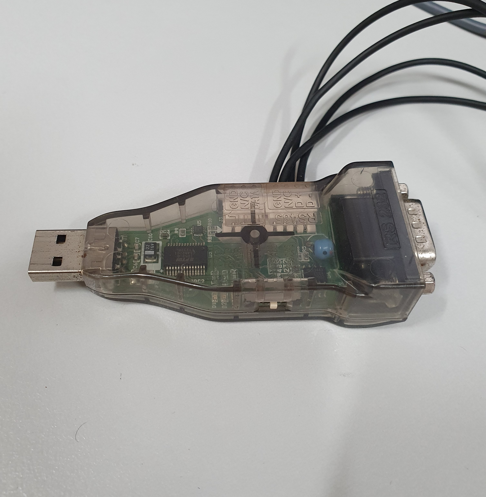

## Servo Calibration

Servos are electrical components that allow for the precise control and positioning of the various limbs attached to the NUgus robot. Usually, when a servo is found to not be performing correctly (i.e. seizing or a crunching sound can be heard), it is required to be removed and replaced with a new servo.

Before a servo is first used, it's default parameters need to be updated to ensure correct operation of the limbs. This is done using [Dynamixel Wizard](https://www.robotis.com/service/download.php?no=1670).

To update the servo parameters, perform the following instructions:

1. Connect the USB to the computer with the Dynamixel Wizard.
   

2. Connect the power supply and the servo to the attached component of the USB.
   

3. Open Dynamixel Wizard.

4. Select Scan and wait for the attached servo to be discovered.

   (OPTIONAL) Brand new servos should be preset to an ID of 1. Lower the ID range in 'Options > Scan' to speed up discovery.
   
   

5. If there a multiple servos discovered, the new servo should be the option with ID = 1 and Baud Rate = 57600 bps.

6. Update the following parameters (don't forget to press save after each update):

   - ID: Varies depending on where the servo will be placed. See below for guidance.

     | Servo Position       | ID  |
     | -------------------- | --- |
     | Right Shoulder Pitch | 1   |
     | Left Shoulder Pitch  | 2   |
     | Right Shoulder Roll  | 3   |
     | Left Shoulder Roll   | 4   |
     | Right Elbow          | 5   |
     | Left Elbow           | 6   |
     | Right Hip Yaw        | 7   |
     | Left Hip Yaw         | 8   |
     | Right Hip Roll       | 9   |
     | Left Hip Roll        | 10  |
     | Right Hip Pitch      | 11  |
     | Left Hip Pitch       | 12  |
     | Right Knee           | 13  |
     | Left Knee            | 14  |
     | Right Ankle Pitch    | 15  |
     | Left Ankle Pitch     | 16  |
     | Right Ankle Roll     | 17  |
     | Left Ankle Roll      | 18  |
     | Head Yaw             | 19  |
     | Head Pitch           | 20  |

     Note that roll is about the x-axis, pitch is about the y-axis, and yaw is about the z-axis.

   - Baud Rate (Bus): 1M bps = 2M/(1 + 1)

     

7. Test the calibration by setting the Goal Position to 0, +90 and -90 and observing the position of the arrow on the horn.

8. Select Disconnect, disconnect both the power and servo from the attached component.

9. Place the servo into the robot.
