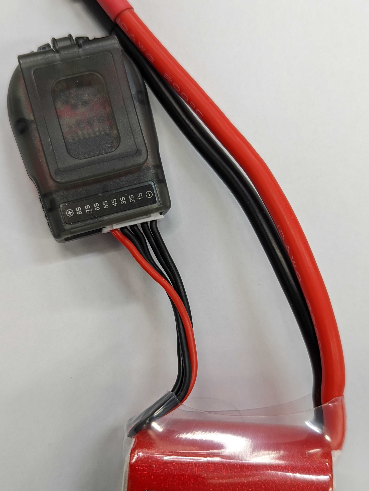
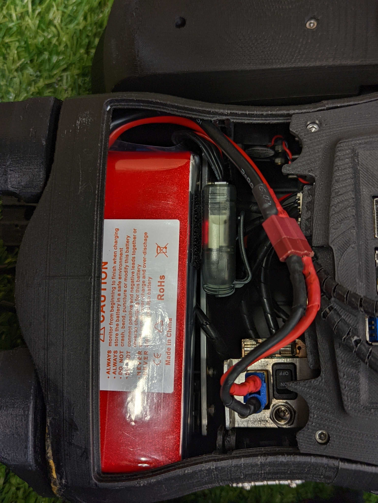
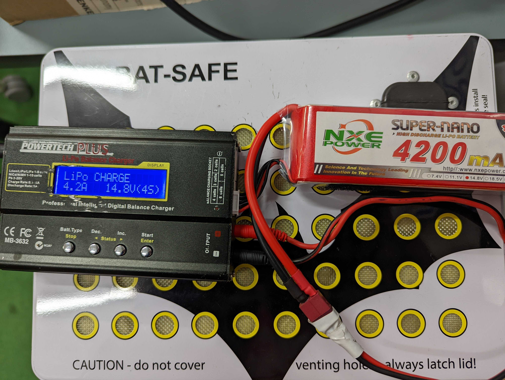
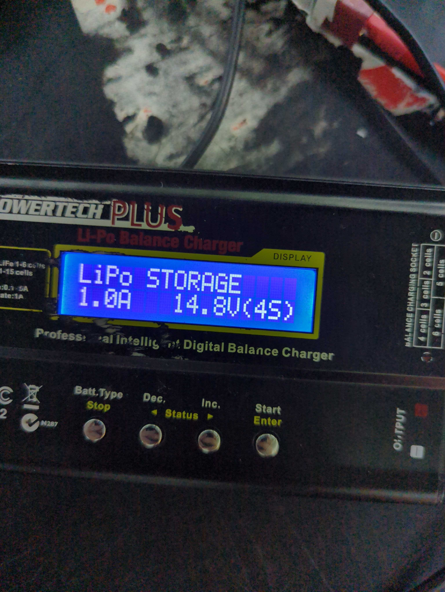

## Battery Safety

<Alert>This page is not designed to be a substitute for the official lab induction, however it should be suitable as a revision tool</Alert>

Our robots have the capability to run on both battery power and by plugging into a power supply. The robots should be run on battery power for events such as
RoboCup, RoboCup qualification videos, lab inductions, and other times were a cable attached to the robot may intefere with its operation. During standard testing in
the lab, you will usually have the robot running off a power supply.

Our NUgus robots run on 4 Cell 14.8V Lithium Polymer (LiPo) batteries, whilst the Darwin robots use a smaller 3 Cell 11.1V model. In order to handle batteries in the
lab you should have completed a formal lab induction.

LiPo batteries can be extremely volatile and should always be handled with the utmost care. When not being used, they should be kept in fire retardant bags and stored
carefully in either the "Flat" or "Charged" drawer depending on its current state.
After use, a battery should be be inspected for any physical damage, and clearly marked and set aside if any is present.

## Using in the robot

<Alert type="warning">Never use a battery in the robot without a battery monitor</Alert>

<Alert type="warning">Always unplug both the robot and the monitor from the battery when not being used. Both of these can lead to the battery going flat beyond
recovery</Alert>

Whenever a battery is being used in the robot, it should be additionally connected to a battery monitor. This ensures that the battery will not run so low that it
will be unusably flat. Unlike regular batteries, LiPo batteries cannot run completely flat unless they are due to be disposed of.

To connect a battery monitor to the battery:

1. Start by finding the cable on the battery with the white plug. Line up the `-` symbol on the monitor with the 5 black leads of the battery cable, and plug in. Be
   aware that the battery monitor will beep several times when this happens, this is normal. 

2. Once the battery monitor is attached to the battery, the other cable on the battery can now be plugged into the robot. Depending on the battery this may require an
   adaptor lead, shown below.

3. Once both cables on the battery are hooked up, the robot can safely be turned on. Be sure to carefully load the battery into the robot to avoid damage, this may
   require some technique so don't be afraid to ask a team member for the best way to go about this.

## Charging

We have two types of chargers in the lab to charge LiPo batteries. Both achieve the same purpose and have a similar user interface. The Powertech Plus charger will be
used for the purposes of the images below.

### Charging a battery

1. Plug the battery cable with the white plug into the corresponding socket on the side of the charger

2. Plug the other battery cable into the main output cable of the charger, this may require an adaptor, as seen in the section on using in the robot

3. Plug the Powertech Plus into a power socket, and use the arrow buttons to select the "Charging" setting for the type of battery you a charging. For the NUgus robot
   battery this is a 14.8V 4 Cell, as seen in the image below. For a Darwin robot battery, this is a 11.1V 3 Cell.

4. Hold down the start button until the device beeps, and observe the content on the screen. If the charging device indicates any errors, stop charging immediately,
   unplug the battery, and return it to a fire retardant case. If there are no errors, press start to commence charging

5. Close and lock the white BAT-SAFE box with the battery inside (Keep the charger outside if possible to hear when it is done)

6. Stay in the lab with the battery and disconnect immediately when charge has completed. Never leave a battery charging when there is no one in the lab

## Storing and Traveling with batteries

When travelling, LiPo batteries should always be kept in fire retardant bags, with one battery stored in each fire retardant bag. If travelling on an aircraft,
LiPo batteries should always go in carry-on luggage, never in checked luggage. It is important to prepare batteries for storage when travel in aircraft. Batteries
should also be prepared for storage when being stored in the lab for an extended period of time.

In both cases, preparing a battery for storage is done by following the same process outlined for charging, however by using the "Storage" setting, as seen in the
image below.

## Disposal of batteries

If a battery has been physically damaged or is showing errors when attempting to charge, it should be disposed of. Batteries for disposal should be taken to the
Electrical Engineering building on campus. Talk to the team leader to confirm the most up to date details of where to take them.
