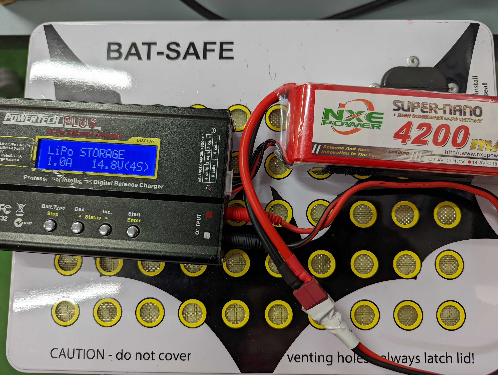

## Battery Safety

Our robots run on 4 Cell 14.8V Lithium Polymer (LiPo) batteries. In order to handle batteries in the lab you should have completed a formal lab induction.

<Alert>This page is not designed to be a substitute for this, however should be suitable as a revision tool</Alert>

LiPo batteries can be extremely volatile and should always be handled with the utmost care. When not being used, they should be kept in fire retardant bags and stored carefully in either the "Flat" or "Charged" drawer depending on its current state.
After use, a battery should be be inspected for any physical damage, and clearly marked and set aside if any is present.

## Using in the robot

Whenever a battery is being used in the robot, it should be additionally connected to a battery monitor. This ensures that the battery will not run so low that it will be unusably flat. Unlike regular batteries, LiPo batteries cannot run completely flat unless they are due to be disposed of.

To connect a battery monitor to the battery, start by finding the cable on the battery with the white plug. Line up the `-` symbol on the monitor with the 5 black leads of the battery cable, and plug in. Be aware that the battery monitor will beep several times when this happens, this is normal.

Once the battery monitor is attached to the battery, the other cable on the battery can now be plugged into the robot. Depending on the battery this may require an adaptor lead, shown below.

Once both cables on the battery are hooked up, the robot can safely be turned on. Be sure to carefully load the battery into the robot to avoid damage, this may require some technique so don't be afraid to ask a team member for the best way to go about this.

<Alert type="warning">It is important to never use a battery in the robot without a battery monitor, and also to unplug both the robot and the monitor from the battery when not being used. Both of these can lead to the battery going flat beyond recovery</Alert>

## Charging

We have two types of chargers in the lab to charge LiPo batteries. Both achieve the same purpose however have a slightly different user interface.

### Powertech Plus

1. Plug the battery cable with the white plug into the corresponding socket on the side of the charger 

2. Plug the other battery cable into the main output cable of the charger, this may require an adaptor, as seen in the section on using in the robot

3. Plug the Powertech Plus into a power socket, and use the arrow buttons to select the "Charging" setting for a 14.8V 4 Cell battery, as seen in the image below

4. Hold down the start button until the device beeps, and the content on the screen indicates the charging has commenced

5. Close and lock the white BattBox with the battery inside (Keep the charger outside if possible to hear when it is done)

6. Stay in the lab with the battery and disconnect immediately when charge has completed. Never leave a battery charging when there is no one in the lab

## Traveling with batteries

LiPo batteries should always go in carry-on luggage in aircraft, never in checked luggage. It is important to partially discharge batteries for travel in aircraft, which is done by following the same process outlined for charging, however by using the "Storage" setting, as seen in the image below.

