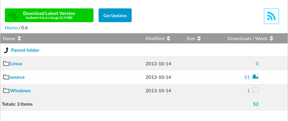
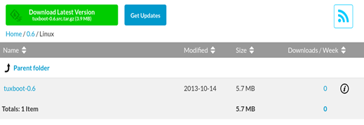
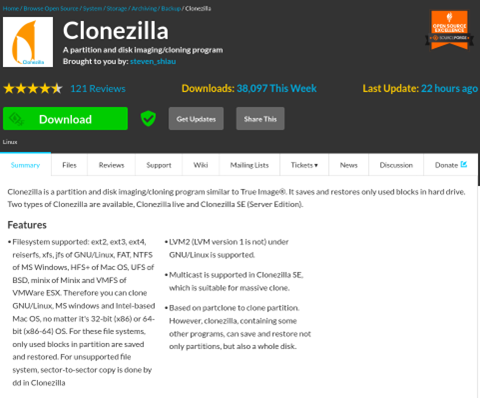
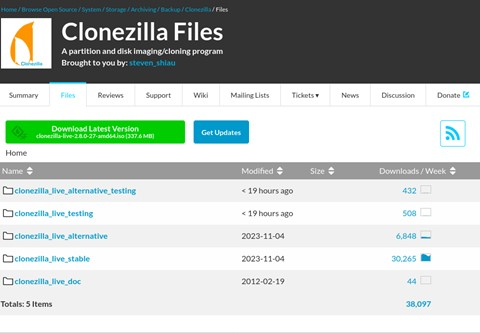
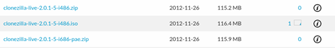
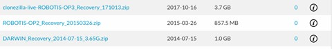
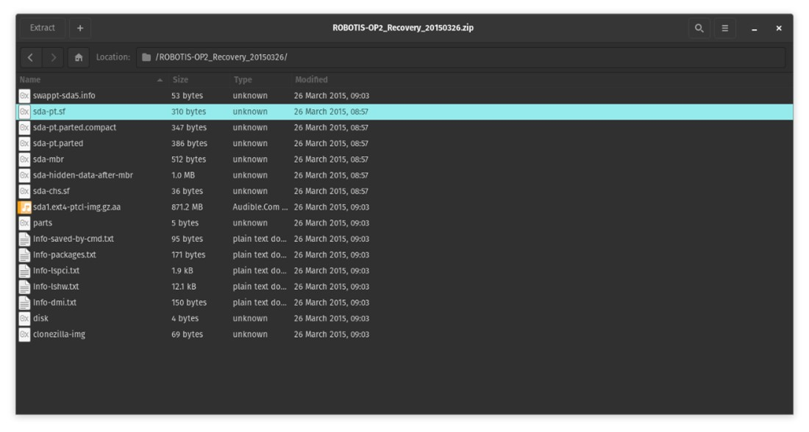

## DARwIn OP2 Guide

### DARwIN OP2 Specifications

  - Mainboard: PICO-CV01
  - Cpu: Intel Atom N2600 @1.6GHz single core
  - Ram: Up to 4GB DDR3/240-ping SO-DIMM module (user replaceable)
  - Storage: Half-size mSATA module (32GB) (user replaceable)
  - Sub controller: CM-740
  - Linux mint 17.3 'Rosa' installed on PICO-CV01 board 

### Creating the recovery USB

1. Download Tuxboot from the [SourceForge website](https://sourceforge.net/projects/tuxboot/files/0.6/). For this demonstration we will be downloading the Linux version.

2. When the first step is complete, run Tuxboot 0.6

3. Using this [Link](https://sourceforge.net/projects/clonezilla/) will take you to the following screen

Click onto the 'Files' tab, then select 'clonezilla_live_stable'.

This will then direct you to a tab filled with different clonezilla versions. What we are looking for is the 'OldFiles' section.

Clicking into this, we now need to look for the section called '2.0.1-5' (in the following picture, it is the middle option)

In this folder, we need to download 'clonezilla-live-2.0.1-5-i486.iso' (in the following picture, it is the middle option)

4. When you have successfully downloaded Clonezilla, reopen Tuxboot. The select the 'pre=downloaded' option on screen.
Select the 'clonezilla-live-2.0.1-5-i486.iso' from your files. Make sure you have ISO selected in the drop-down menu, for the 'Type' selection, pick USB and tick the MD5 check box.

After you have done this step, press 'OK' and let the program run.

Once this is complete press 'Exit'.

This completes the Clonezilla portion of this recovery USB.

**Now that you have successfully created a Clonezilla USB, we now need to put the recovery software onto it. This is done by following the instructions below**

5. Open your USB in your files but leave this for now and following the following [Link](https://sourceforge.net/projects/darwinop/files/Software/Main%20Controller/Recovery%20USB/)
We now need to download the DARwIn recovery files. For this example, we are downloading the 'ROBOTIS-OP2_Recovery_20150326.zip'
(for the following picture, it is the middle option)

After this has finished downloading, we need to create a 'home' folder in our USB. When you have created such folder, click into it and create another folder called 'partimag', then click into it.
Leave this for the time being.

Now, go into your downloads and locate your 'ROBOTIS-OP2_Recovery_20150326.zip', unzip the file and click into it.
(it should look like this)

Select all these files and move them into your 'partimag' folder.
`USB / home / partimag`

**You have now completed the ‘creating the recovery USB’ section successfully!**

### Running the recovery USB through the BIOS 

Now that we have a recovery USB created with all the right files placed upon it, it is now time to run it on the PICO-CV01 board.

1. Boot up your PICO-CV01 in the BIOS menu (this is usually done by pressing either f12 or delete), locate the 'boot' tab and search for 'boot sequence'.
Select the Clonezilla USB as the first selection for the sequence, save the changes and restart.
Once this restarts, Clonezilla should boot up straight away.

2. When Clonezilla boots, a menu screen will appear, the following instructions show be followed:
      1. Clonezilla
          - Select te default option **'Clonezilla live (default settings. VGA 800x600)'**

      2. Language
          - Choose language **'Whichever is your preferred language'**
      
      3. Configuring Console-data
          - Select default option **'Don't touch keymap'**

      4. Start Clonezilla
          - **'Start_Clonezilla Start Clonezilla'**

      5. Clonezilla
          - Select default option **'device-image work with disks or partitions using images'**
      
      6. Mount Clonezilla Image Directory 
          - Select the following **'skip Use existing/home/partimag (Writable device. E.g. hard disk/USB drive)'**

      7. Clonezilla - OpenSource Clone System (OCS)
          - Select the following **'Beginner Beginner mode'** then **'Accept the default options'**

      8. Clonezilla Select mode
          - Select the following **'restoredisk Restore_an_image_to_local_disk'**

      9. Clonezilla - OpenSource Clone System (OCS)
          - Choose the image file to restore **'this will be your recovery image'**
      
      10. Clonezilla - OpenSource Clone System (OCS)
          - Choose the target disk **'this will be your SSD (make sure to check your SSD capacity to see if the recovery files will fit!)'** 

      11. Starting to Restore Image to Device
          - Wait until this is complete.

      12. Completed Restoration
          - Press enter to continue

      13. Power Off or Reboot
          - Select one of the following options **'(0) Power Off, (1) Reboot'**

      14. When the power off have successfully shut the DARwIn down, remove the USB and reboot the robot.
  
For more information about this process check out [Robotis's Clonezilla recovery page](https://emanual.robotis.com/docs/en/platform/op/maintenance/).

### Calibrating the DARwIn OP2 (Ball Calibration)

1. Connect the Darwin via ethernet onto a laptop on the same internet.

2. Using a portable monitor, plug in a HDMI to mini HDMI cable (mini is to be connect to the Darwin, normal HDMI being connected to the monitor).

3. Start the Darwin so the standard demo program is running. Once booted, and in the initial pose, sitting.

4. Connect a keyboard and mouse to the Darwin and use them to connect to the robot via SSH in the terminal: `SSH robotis@192.168.123.1`, **with password "111111" (six ones, no quotation marks)**

5. Once you are connected to the Darwin, use a browser (either chrome or firefox) to talk to the robot. The web address should be (http://192.168.123.1:8080/)

6. While on this web address you should see the camera's live feed, with camera parameters on the side and bottom of image.

7. The important parameter is the ball (you will find this is the Darwin transport case. It is orange in colour).
You will see the section of the camera view highlight pixels in orange, this is showing you an output of its applied color look up table for the ball. You don't want too many of these random 
pixels around if there is no ball in front of the robot, but once you place a ball in front of the robot, it should see it with the orange applied over the ball.

8. Once you are happy with the calibration, press save and exit the program. 

For more information on camera Calibration follow this [Link](https://emanual.robotis.com/docs/en/platform/op2/getting_started/#camera-calibration)

### Calibrating the DARwIn OP2 (Walk Tuner)

1. Connect to the robot via ssh in the terminal: `SSH robotis@192.168.123.1`, **with password "111111"**.

2. While in the terminal, stop the demo binary (as it boots from the start) by using sudo pkill demo.

3. Change the current directory to the walk tuner directory: `cd/robotis/Linux/project/walk_tuner/`

4. Run this walk tuner by: `./walk_tuner`

5. While on this terminal, a prompt will ask for the user to press any key to start the tuner. After this, a browser will be needed to access the parameters to tune: (http://192.168.123.1:8080/)

6. Once on this browser, you will see different options to tune. You can change these until you are happy with the walk.
<Alert> 
  Some of the important options that have been used previously are gains, PID controller, step height, DSP ratio, and duty cycle.
</Alert>

7. Once you are happy, press save and exit the program.

For more information on parameters follow this [Link](https://emanual.robotis.com/docs/en/platform/op/development/)
