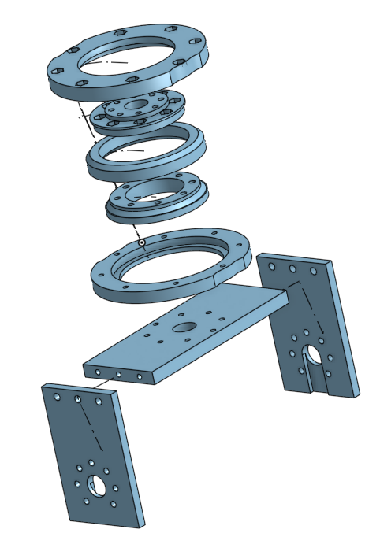
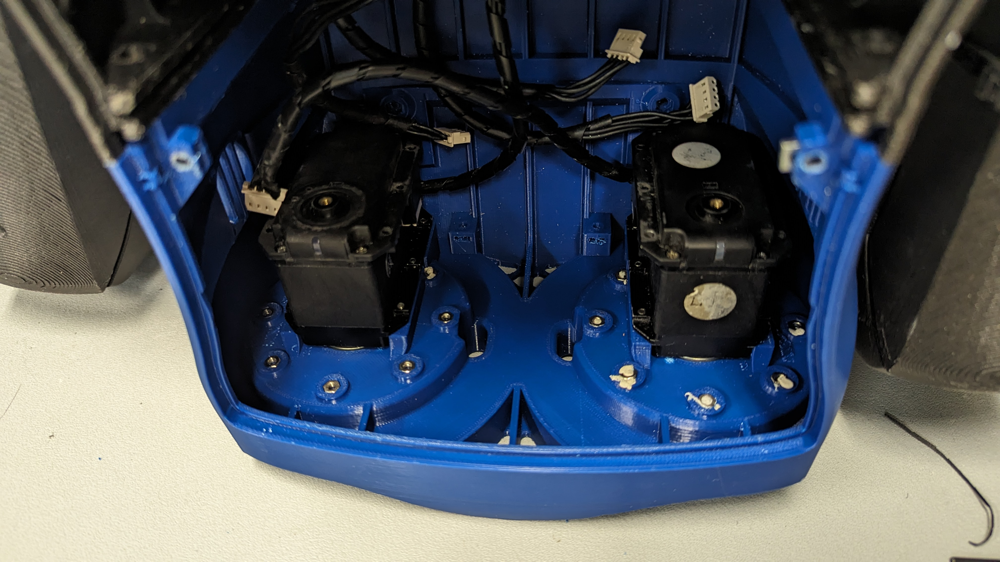
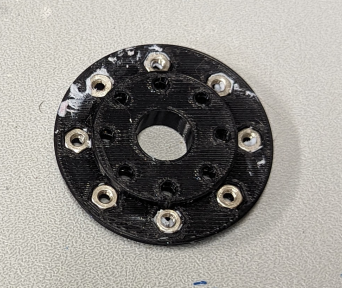
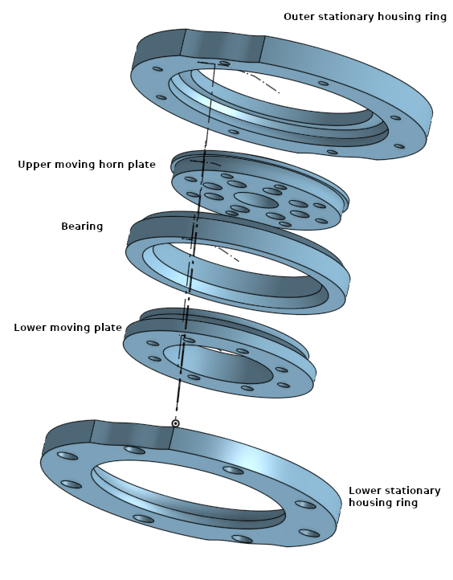
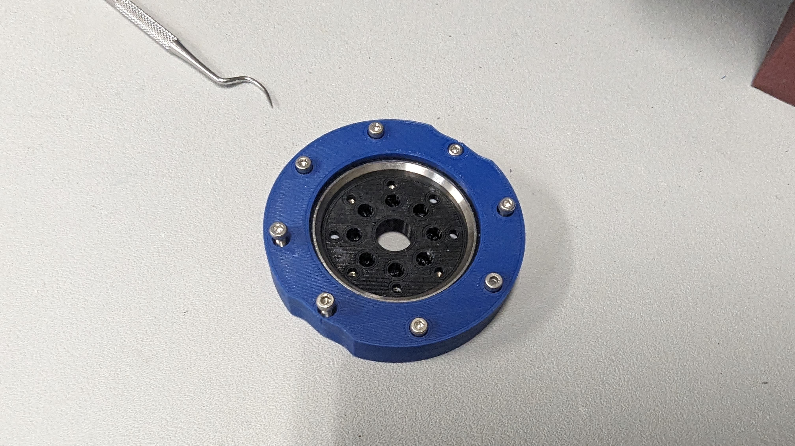
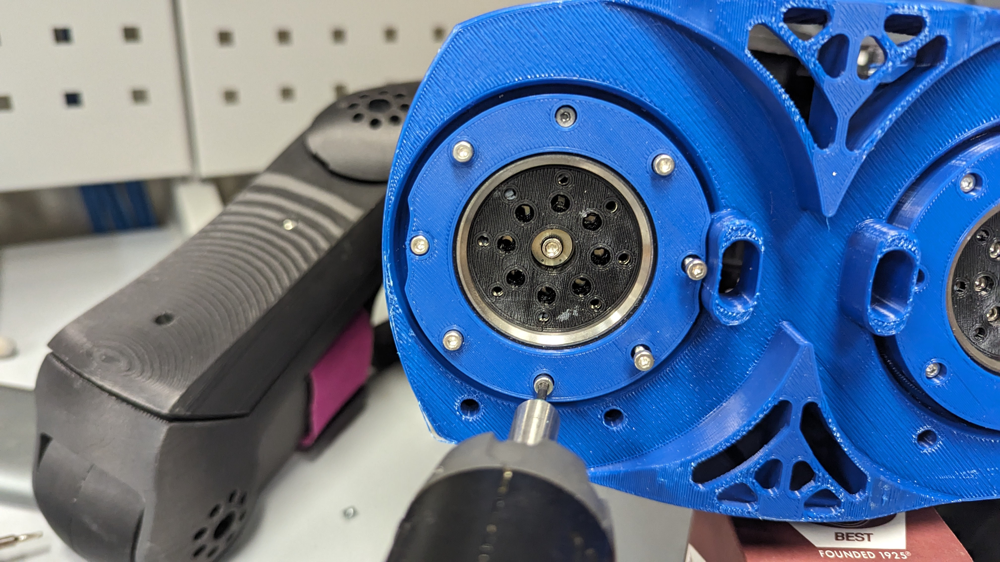
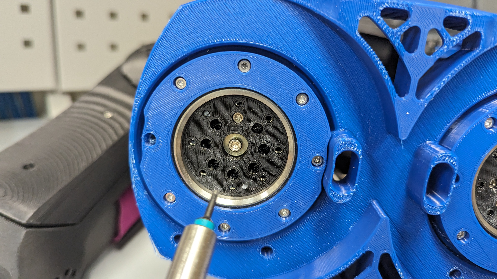
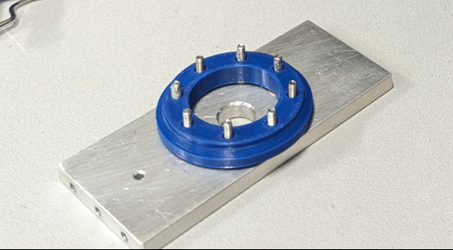
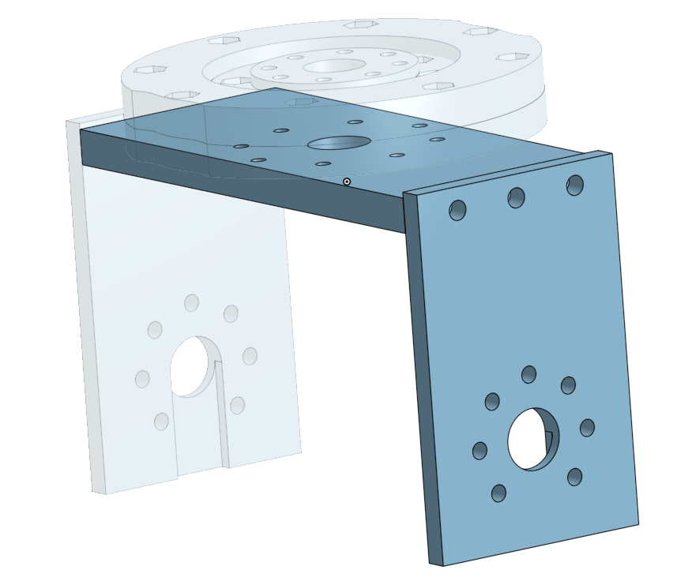

The current hips on the NUgus are a multi piece unit designed to spread the load of each leg across a wide area on the bottom of the torso. There are 7 major pieces per hip that when bolted together form a bearing housing with a stationary outer ring and moving inner ring, and a bolted aluminium U piece that forms the hip servo block mount.

## Initial Assembly

1. There are 8 nut captures per hip inside of the lower torso that are the main mounting points for the bearing assembly and require 2.5mm hex nuts. Before inserting the nuts it is advised to place a small ball of blue-tack or similar material in each nut capture so that the nuts don't fall out when turning the torso over in later steps. This is easier to do with the hip motors removed.
   

2. The servo horn mounting plate is a smaller plate with 8 x 2.5mm nut captures forming an outer ring. This piece will later be bolted to the servo horn using the inner ring of mounting holes. These nut captures will require the nuts be inserted before assembly in the same manner as the previous step.
   

NOTE: The upper stationary ring also has 8 x 2.5mm hex nut captures on top that are not used.

## Assemble the Bearing Housing

The bearing housing is made up of 2 stationary outer rings (upper and lower), 2 moving inner plates (upper and lower) and the bearing itself. The bearing has a chamfered outer edge one side, and a chamfered inner edge on the other. The outer chamfered edge will face up when it's placed in the housing. The housings are shaped to accept the chamfered bearing edges in this orientation. The upper housing ring has a chamfered edge, as does the lower inner plate.

1. Insert the bearing into the upper housing ring with the outer chamfered edge of the bearing facing into the housing.
2. Place the lower housing ring on top of the bearing, taking care to align the bolt holes of the housing as well as the scalloped edges on each side of the housings.
3. Insert the upper bearing plate into the top of the bearing. We should have something that looks like the image below.
   

## Bolting the Bearing Housing to the Torso

Note: At this point, aligning bolt holes with the servo horn witness marks is not necessary. That will be important later when we bolt on the aluminium hip block mount.

1. Place the bearing housing assembly into the lower torso, aligning one of the scalloped edges of the outer housings with the cable exit hole.
   
2. Prepare the bolts with a small dot of 222 Loctite on the threads. This will help prevent the bolts from coming loose over time.
3. Place the bolts slightly into the outer housing holes. Do not try to push them all the way through to the torso, as this could dislodge the nuts. With the bolts slightly inserted into the housings, partially tighten the bolts in a star pattern. For example, tighten the bolt at the 12 o'clock position, then the bolt at the 6 o'clock position, and so on. Repeat this pattern until all bolts are tightened. Tightening bolts is best done with one of our panasonic electric screw drivers. These have a torque setting that will prevent over tightening and stripping the threads. As a general rule, for the first pass of tightening we use the lowest torque setting, which is 1 on the dial. Then on the final pass we use the 1.5 setting.  
   
4. Prepare the small bolts (sizes to be added) with a small dot of 222 Loctite on the threads.
5. We can now bolt the horn plate in the centre of the housing to the servo horn in the same star pattern we used in step 3.
   

## Assemble the Main Servo mount plate and the Lower Inner plate

1. Place the lower inner plate (long aluminium piece with ) on the main servo mount plate, aligning the bolt holes.
2. Insert a bolt in each hole and place a dot of 222 Loctite on the threads.
   
3. Ensure that the witness marks on the servo horn are pointing towards the back of the robot.
4. We can now insert the lower plate assembly into the bearing housing. Ensuring the witness marks on the servo horn are pointing towards the back of the robot.
   
5. Tighten the bolts in the same star pattern as before.

## Attach the hip block servo plates

1. The hip block servo plates are bolted to the main servo block plate using two 4mm dome headed bolts. It's important to use dome headed bolts for clearance when the hips are slewing. You may notice there are provisions for 3 bolts when attaching the horn plates, only the outer two are used. The inner hole is left vacant.
   
