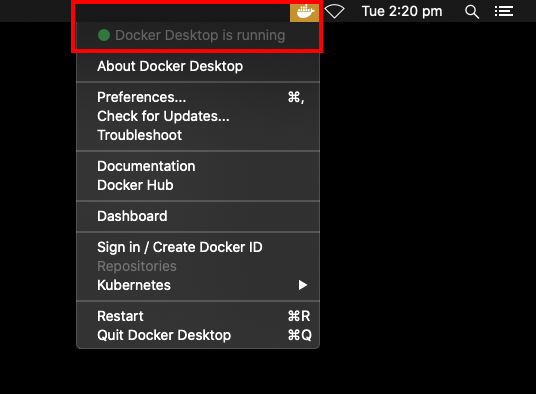

## Prerequisites

We recommend a Unix-based operating system like Linux or macOS for developing and running NUbots code. Currently Windows is not officially supported due to lack of support for the `termios` Python module that is used in the Docker build script. We hope to find a fix for this soon.

You can find free downloads for [Ubuntu](https://ubuntu.com/), a user-friendly Linux distribution, at their website.

### Git

To begin, you will need to the [git](https://git-scm.com/) command-line tool and download the NUbots repository from GitHub. You can do this by running the following commands in a terminal:

```bash
sudo apt install git
git clone https://github.com/NUbots/NUbots.git
```

[GitKraken](https://www.gitkraken.com/) is a useful GUI for GitHub repositories, or you can use [Git in the terminal](https://git-scm.com/docs/git).

If you are using Windows, install [git for Windows](https://gitforwindows.org/). Open git bash and run

```bash
git clone https://github.com/NUbots/NUbots.git
```

The repository will be cloned to whichever folder you are located in in the terminal.

### Docker

Now that the repository is on your computer, install Docker using the instructions below.

#### Ubuntu

Add Docker's stable repository and update apt package index.

```bash
curl -fsSL https://download.docker.com/linux/ubuntu/gpg | sudo apt-key add -
sudo add-apt-repository \
   "deb [arch=amd64] https://download.docker.com/linux/ubuntu \
   bionic \
   stable"
sudo add-apt-repository universe
sudo apt update
```

Install the latest Docker.

```bash
sudo apt-get install docker-ce docker-ce-cli containerd.io
sudo apt-get install python3 python3-pip
```

Add the current user to the Docker group.

```bash
sudo usermod -aG docker "${USER}"
```

Reboot to make the group change take effect.

Install the required Python dependencies.

```bash
sudo -H pip3 install -r NUbots/requirements.txt
```

#### Mac OS

Install [Homebrew](https://brew.sh/).

Install python 3 and docker.

```bash
brew install python3
brew cask install docker
```

Run the docker app that was installed which should add a docker icon to the menu bar. Ensure that docker is running (it will show a green light) before trying to run NUbots code.



By default the docker install will allocate 2GB of memory to docker images. When building the images this is insufficent for some of the libraries and will result in an error. In the menu bar go to advanced settings and increase the memory available.

Install the required python dependencies

```bash
pip3 install -r NUbots/requirements.txt
```

### A Text Editor

Next download your favourite text editing program. We recommend [Visual Studio Code](https://code.visualstudio.com/Download). The NUbots codebase requires correct formatting. This is provided by clang-format, which can be installed in Visual Studio Code through the marketplace. A useful extension for the NUbots codebase is the Remote Development Containers extension. This extension allows Visual Studio Code to open the Docker container and operate within it.

## Building NUbots Code

Open a terminal and enter

```bash
cd NUbots
```

Now you should be in the NUbots folder. Next you will need to specify a platform to build to.

```bash
./b target *platform*
```

Replace `*platform*` with your desired platform. This will be `generic`, if you are going to be running code on your own computer, or `nuc7i7bnh` if you are building code to execute on a robot. This would build code that is optimised specificially to run on the platform that is currently used in the NUgus robots. Note that when building for other platforms than generic, the code may not be able to execute on your own computer depending on the CPU that you have.

Next you need to choose what you would like to build. Run

```bash
./b configure -i
```

Enable what you would like to build and press `c` to configure and then `g` to generate and exit. Next you need to compile and build the code! Run

```bash
./b build
```

What you do next depends on whether you are running your code on a robot or a simulated robot.

### Simulated Robot

If you are not running your code on a robot, you will need a simulated robot to run it. If, for example, you want to run a role called ‘test’, you would run

```bash
./b run test
```

Roles run this way generally contain `platform::darwin::HardwareSimulator`, the module for simulating hardware input and output.

Configuration (.yaml) files are linked to the config files in the NUbots code. If you change the config file, you will need to run `./b build` again.

### Real Robot

To build to a real robot you will need to find out the ip of the robot. This corresponds to the number of the robot (1, 2, or 3). Make sure the robot is powered on. Enter:

```bash
./b install n**
```

Where the first \* corresponds to 1, 2, or 3. The second \* relates to writing config to the robot. Leaving this blank only writes new config to the robot. Using `u` overrides any matching config files on the robot if yours are newer. Using `o` will override any matching config files on the robot. Using `t` will install the toolchain files on to the robot.

Next open a new terminal. Type

```bash
ssh nubots@10.1.1.*
```

Where \* corresponds to 1, 2, or 3 depending on the robot. Now you can run whatever you have built to the robot! For example, if you want to stand the robot up, run

```bash
./scriptrunner Stand.yaml
```

And then press the green middle button on the back of the robot. This runs a script. A list of scripts the robot can execute can be found on the robot in the scripts folder. If you would like to run something other than a script, for example robocup, then enter:

```bash
./robocup
```

Roles that are run this way generally contain `platform::darwin::HardwareIO`, the module that deals with hardware input and output from the robot.

Configuration (.yaml) files can be found in the config folder on the robot, and can be robot specific. These are in folders specific to the robot (i.e. nugus1, nugus2, nugus3).
