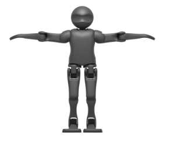
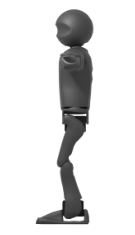

The platform used is the NUgus, based off the [igus® Humanoid Open Platform](http://www.nimbro.net/OP/). The NUgus robots are 3D printed using fused deposition modelling. Because of this, the components of the robot were split to allow for the size of the printer bed and the printer volume. The torso was also modified to have open shoulder covers for shoulder servo cable access.

The arms and head of the NUgus robot use [MX64AR servos from Dynamixel](http://www.robotis.us/dynamixel-mx-64ar/). The legs use [MX106 servos from Dynamixel](http://support.robotis.com/en/product/actuator/dynamixel/mx_series/mx-106.htm). The robots use two [FLIR Blackfly S](https://flir.app.boxcn.net/s/x0r0bdsjstdkudjd2dwlxoa5fdvj2gpg/file/418603726810) cameras positioned in their head. In the torso lies the Intel NUC7i7bnh, 8GB RAM, 256GB SSD, Robotis CM740 subcontroller, and a 3850mAh 4s LiPo battery.