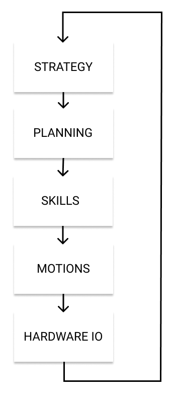

The software side of the team is split into the NUbots repository and the NUsight repository. Both are detailed below.

## Languages

Most of the NUbots codebase is written in C++, with some Python. The build system uses CMake, with some Python. The virtual machine provisioning uses Puppet (variant of Ruby). Ruby is used for vagrant control of virtual machines. Protobuf is used for messages. NUsight uses typescript. NUbook uses markdown, HTML, css, jsx, and javascript.

## NUbots

The NUbots repository is the main codebase that runs on the robots. Its purpose is to control the robot during RoboCup matches. The NUbots codebase, along with all other NUbots code, is open source and can be [found on GitHub](https://github.com/NUbots/NUbots/). The primary language in the NUbots codebase is C++.

The main parts of the NUbots codebase are behaviour, motion, vision, and localisation. Behaviours include strategy, planning and skills. Motion includes kicking, getting up, and walking. Vision includes ball, goal and field detectors. Localisation determines where the robot, ball and the field are in the world through odometry. 

At the top level, the robot will use strategy to decide what to do, such as whether it will act as a goalkeeper or if it will act like a striker. 

The next level down is planning. This includes planning the path to walk along to get to the ball facing the right goal. 
Below planning is skills. Skills include kicking, walking, getting up, and looking at objects. 

Next is motions. Motions include how the robot moves its feet to walk, and what movements it does to kick or get up.

After motions is hardware IO. The hardware will output the commands and input the information from the world. This will then go through a sensor filter so that the robot can interpret the information. This information then influences strategy.

All these modules are connected using NUClear which is a message passing software architecture. More can be found on NUClear [here](https://nuclear.readthedocs.io/en/latest/).



## NUsight

NUsight is a debugging tool for the NUbots codebase. It contains many functionalities for debugging a range of areas in the NUbots codebase.

When a robot has connected to NUsight, the button in the top right corner will list that robot. When NUsight is getting information from the robot, the circle next to the robot name will light up green. 

The first tab in NUsight is the dashboard. *explanation of the dashboard*

The second tab in NUsight is the localisation tab. This shows a 3D view of a soccer field with any robots that have connected to NUsight positioned in the field. The position and movements of the robot come from … . When localisation view window is selected, one can move the mouse to rotate the view. When there is a robot selected, one can press the spacebar to switch between free camera view, first person view, and third person view relative to that robot. Escape key will deselect the localisation view. The ‘hawk eye’ button in the top bar will move the view to look directly down at the field.

The next tab is the chart tab. Any graph messages that are emitted from the NUbots code will appear here. This is done using

```cpp
emit(graph(“graph name”, variable));
```

The graph range can be specified, and graphs can be displayed as line charts or 2D scatterplots. All graphs that can be viewed will be listed per robot on the right hand side with a checkbox. Any number of graphs can be shown at a time. Hovering over the graph name on the right hand side will highlight that graph. The colour of each graph will be specified next to the graph name on the right hand side. 

The fourth tab is the vision tab. This receives images from the robot’s camera. *something about detection of objects like ball, field, goalposts*

The final tab is the visual mesh tab. *what the visual mesh tab does*
