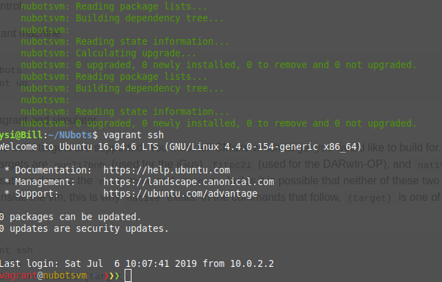

## Setting Up The VM
Open a console and enter

```bash
cd NUbots
```

Now you should be in the NUbots folder. Enter the following to create and access the VM:

```bash
vagrant up
vagrant provision
vagrant ssh
```

Your console should now look like the following.



Check out the troubleshooting section if it does not. If the troubleshooting section does not help, ask a teammate for help on Slack!

Note that you don’t need to run `vagrant provision` every time you boot up the VM, but you will need to do it the very first time you set up the VM.

## Building Code

Now that you are in the virtual machine, let’s try building something! The next commands you need are:

```bash
cd NUbots
./b platform select *platform*
cd build
```

Replace `*platform*` with your desired platform. This can be `native`, if you are building just to the VM, or `nuc7i7bnh` if you are building to a robot. This depends on if you want to run code on a robot or if you want to run code for a simulated robot. `cd build` will move to the build directory you just created, which is symlinked to `build_*platform*`

Next you need to choose what you would like to build. Run 

```bash
ccmake ..
```

Enable what you would like to build and press `c` to configure and then `g` to generate and exit. Next you need to compile and build the code! Run

```bash
ninja
```

What you do next depends on whether you are running your code on a robot or a simulated robot. 

### Simulated Robot

If you are not running your code on a robot, you will need a simulated robot to run it. If, for example, you want to run a role called ‘test’, you would run

```bash
./bin/test
```

Configuration (.yaml) files can be found in the `config` folder. 

### Real Robot
To build to a real robot you will need to find out the ip of the robot. This corresponds to the number of the robot (1, 2, or 3). Make sure the robot is powered on. Enter:

```bash
ninja i**
```

Where the first * corresponds to 1, 2, or 3. The second * relates to writing config to the robot. Leaving this blank only writes new config to the robot. Using `u` overrides any matching config files on the robot if yours are newer. Using `o` will override any matching config files on the robot. Using `t` will install the toolchain files on to the robot.

Next open a new console. Type 

```bash
ssh nubots@10.1.1.1*
```

Where * corresponds to 1, 2, or 3 depending on the robot. Now you can run whatever you have built to the robot! For example, if you want to stand the robot up, run

```bash
./scriptrunner Stand.yaml
```

And then press the green middle button on the back of the robot. This runs a script. A list of scripts the robot can execute can be found on the robot in the scripts folder. If you would like to run something other than a script, for example robocup, then enter:

```bash
./robocup
```

Configuration (.yaml) files can be found in the config folder on the robot, and can be robot specific. These are in folders specific to the robot (i.e. igus1, igus2, igus3).