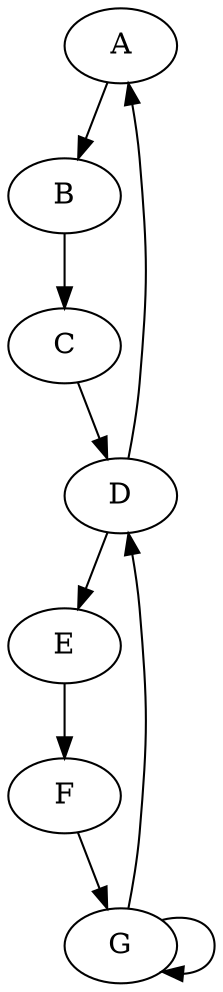

# Graphs and Diagrams

## Using circo layout

The following code in Markdown:

````md
```circo
# A graph showing the dependencies in the system
# Drawn using GraphViz with circo layout
digraph {
    A -> B;
    B -> C;
    C -> D;
    D -> A;
    D -> E -> F -> G -> D;
}
```
````

Produces the following graph:

```circo
# A graph showing the dependencies in the system
# Drawn using GraphViz with circo layout
digraph {
    A -> B [label="AB"];
    B -> C;
    C -> D;
    D -> A;
    D -> E -> F -> G -> D;
}
```

## Using dot layout

The following code in Markdown:

````md

````

Produces the following graph:


## Using fdp layout

The following code in Markdown:

````md
```fdp
# A graph showing the dependencies in the system
# Drawn using GraphViz with fdp layout
digraph {
    A -> B;
    B -> C;
    C -> D;
    D -> A;
    D -> E -> F -> G -> D;
}
```
````

Produces the following graph:

```fdp
# A graph showing the dependencies in the system
# Drawn using GraphViz with fdp layout
digraph {
    A -> B;
    B -> C;
    C -> D;
    D -> A;
    D -> E -> F -> G -> D;
}
```

## Using neato layout

The following code in Markdown:

````md
```neato
# A graph showing the dependencies in the system
# Drawn using GraphViz with neato layout
digraph {
    A -> B;
    B -> C;
    C -> D;
    D -> A;
    D -> E -> F -> G -> D;
}
```
````

Produces the following graph:

```neato
# A graph showing the dependencies in the system
# Drawn using GraphViz with neato layout
digraph {
    A -> B;
    B -> C;
    C -> D;
    D -> A;
    D -> E -> F -> G -> D;
}
```

## Using osage layout

The following code in Markdown:

````md
```osage
# A graph showing the dependencies in the system
# Drawn using GraphViz with osage layout
digraph {
    A -> B;
    B -> C;
    C -> D;
    D -> A;
    D -> E -> F -> G -> D;
}
```
````

Produces the following graph:

```osage
# A graph showing the dependencies in the system
# Drawn using GraphViz with osage layout
digraph {
    A -> B;
    B -> C;
    C -> D;
    D -> A;
    D -> E -> F -> G -> D;
}
```

## Using patchwork layout

The following code in Markdown:

````md
```patchwork
# A graph showing the dependencies in the system
# Drawn using GraphViz with patchwork layout
digraph {
    A -> B;
    B -> C;
    C -> D;
    D -> A;
    D -> E -> F -> G -> D;
}
```
````

Produces the following graph:

```patchwork
# A graph showing the dependencies in the system
# Drawn using GraphViz with patchwork layout
digraph {
    A -> B;
    B -> C;
    C -> D;
    D -> A;
    D -> E -> F -> G -> D;
}
```

## Using twopi layout

The following code in Markdown:

````md
```twopi
# A graph showing the dependencies in the system
# Drawn using GraphViz with twopi layout
digraph {
    A -> B;
    B -> C;
    C -> D;
    D -> A;
    D -> E -> F -> G -> D;
}
```
````

Produces the following graph:

```twopi
# A graph showing the dependencies in the system
# Drawn using GraphViz with twopi layout
digraph {
    A -> B;
    B -> C;
    C -> D;
    D -> A;
    D -> E -> F -> G -> D;
}
```
