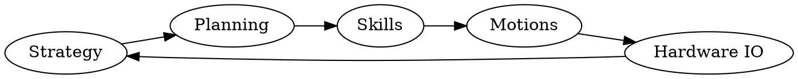

# Graphs and Diagrams

```circo
# A graph showing a circular dependency structure
# More detailed description for a11y
graph {
  A -- B [label="OK Boomer"]
  B -- D; B -- C; C -- D;
  C -- A
  D -- A
}
```

# Overview


